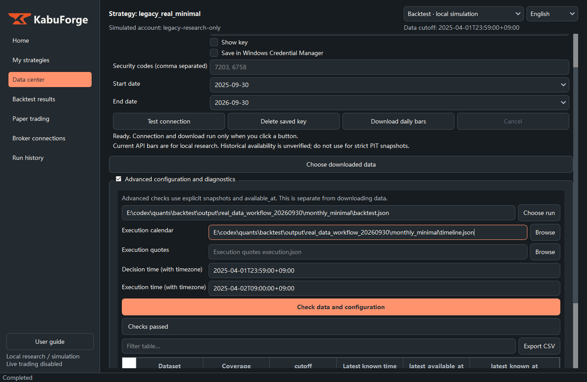

# KabuForge · JP Equity Backtest Console

[简体中文](README.md) · [日本語](README.ja.md) · [English](README.en.md)


**A local desktop workbench for Japanese equity research, reproducible simulation, and inspectable execution records.**

KabuForge is the new generation of this repository's research workbench. It offers a Chinese/Japanese/English interface, guided strategy forms, offline manuals, public factors, strict input identity checks, and a simulation engine that separates signals from execution. The repository was renamed from `JP-Equity-Backtest-Console` to `KabuForge`; GitHub redirects the old URL. The legacy GUI and CLI remain available; see the [legacy README](docs/LEGACY_README.md).

This distribution uses only the **public factors** already in this repository's `factors/` directory. Standard 12-1 momentum has the identity `public.momentum_12_1`. The author's private residual momentum and other private factors are neither included nor imported, and public factors are not presented as substitutes for them. No market datasets, account records, or credentials are distributed with the code.

## Quick start

On Windows, install Python 3.12 and PowerShell 7, then run these commands from the repository root:

```powershell
py -3.12 -m venv .venv-gui
.\.venv-gui\Scripts\python.exe -m pip install -r framework_v2/requirements-gui.txt
.\Launch_KabuForge.bat
```

After installation, double-click `Launch_KabuForge.bat` to launch the workbench. Start with the offline demo on the home page, then create a strategy, run a simulation, and inspect the results. The launcher itself does not install dependencies. The existing `start_here.bat` entrypoint continues to launch the legacy GUI.

You can also launch the workbench directly:

```powershell
.\.venv-gui\Scripts\python.exe -B -m framework_v2.workbench_qt --workspace output/my_workspace
```

## Workflow demonstrations

The existing local Chinese, Japanese, and English recordings are reused without changing their GIFs or screenshots. They show a historical research workflow; their curves are not results of this public factor distribution. The demonstrations do not include the underlying market data, strategy configurations, or ledgers.

| 中文 | 日本語 | English |
| --- | --- | --- |
| [操作演示](docs/demos/zh_CN/index.html) | [操作デモ](docs/demos/ja_JP/index.html) | [Workflow demo](docs/demos/en_US/index.html) |



[Trilingual demonstration index](docs/demos/index.html) · [中文 GIF](docs/demos/zh_CN/workflow.gif) · [日本語 GIF](docs/demos/ja_JP/workflow.gif)

## Documentation

| Topic | Resource |
| --- | --- |
| Installation, launch, and operation | [Operations guide — Chinese](docs/OPERATIONS.md) |
| Step-by-step offline demonstration | [Demo guide — Chinese](docs/DEMO.md) |
| Modules, data flow, and execution boundaries | [Architecture — Chinese](docs/ARCHITECTURE.md) |
| Engine interfaces and limitations | [Engine documentation — Chinese](framework_v2/README.md) |
| Complete offline manuals | [English](framework_v2/docs/manual_en_US.html) · [中文](framework_v2/docs/manual_zh_CN.html) · [日本語](framework_v2/docs/manual_ja_JP.html) |
| Validation of this release | [Validation record — English](docs/RELEASE_VALIDATION.md) |
| Legacy configuration and operation | [Legacy README — English](docs/LEGACY_README.md) |

Download the repository and open the HTML manuals in a browser, or press F1 in the workbench. GitHub's file view displays their source code.

## Offline CLI demonstration

Run these commands from the repository root. Use new output directories for each run.

```powershell
.\.venv-gui\Scripts\python.exe -B -m framework_v2.cli demo --out output/demo
.\.venv-gui\Scripts\python.exe -B -m framework_v2.cli validate output/demo/backtest.json
.\.venv-gui\Scripts\python.exe -B -m framework_v2.cli history output/demo/backtest.json --timeline output/demo/timeline.json --out output/history
```

`demo` checks that backtest, paper, and fake modes produce identical order intents; it does not submit orders. `history` produces local simulated NAV, orders, fills, and logs. The CLI demonstration uses synthetic inputs and provides no evidence of real investment performance.

## Engine features

- Configuration graphs, data snapshots, and factor implementations are bound to identities and content hashes.
- Factors can read only data whose `available_at` is known at the decision time. A current API download does not automatically establish historical point-in-time validity.
- Signals, risk constraints, quantity planning, and simulated fills are separate layers. Later execution prices cannot be used to reselect historical targets.
- SQLite transactions record orders, events, fills, account revisions, and decision evidence. An unknown order state blocks blind resubmission.
- The workbench includes a trilingual interface, searchable offline manuals, reopenable strategy drafts, run history, and a read-only ledger view.
- J-Quants v2 downloads support pagination, cancellation, resumption, and local integrity checks. Users provide their own access entitlement.

## Scope and limitations

This software is for research and simulation. It is not investment advice or a live trading system. Real broker connections, native Excel integration, automatic recovery of historical runs, and certification of strategy validity have not been delivered. Protocol adapters and mock tests do not establish a working live broker connection.

Simplified price research using downloaded daily bars has a different data contract from the strict point-in-time engine. It uses fractional shares and does not include full trading-lot, slippage, dividend, or capacity audits. No equivalent migration of the complete legacy composite/regime algorithms is claimed. See the [disclaimer](DISCLAIMER.md) and [license](LICENSE).

## Development checks

```powershell
.\.venv-gui\Scripts\python.exe -B -m unittest discover -s framework_v2/tests -q
.\.venv-gui\Scripts\python.exe -B -m framework_v2.capture_acceptance --output output/gui_acceptance
```

The acceptance script uses offscreen Qt widgets and synthetic/mock inputs. It does not test native mouse interaction, real API entitlements, or live-trading readiness.
