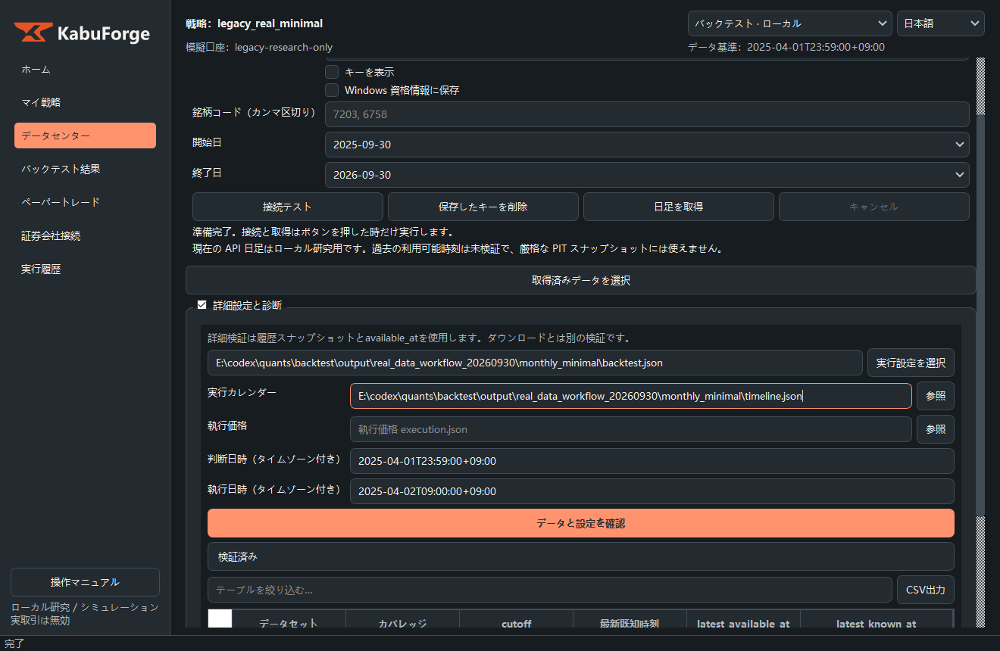
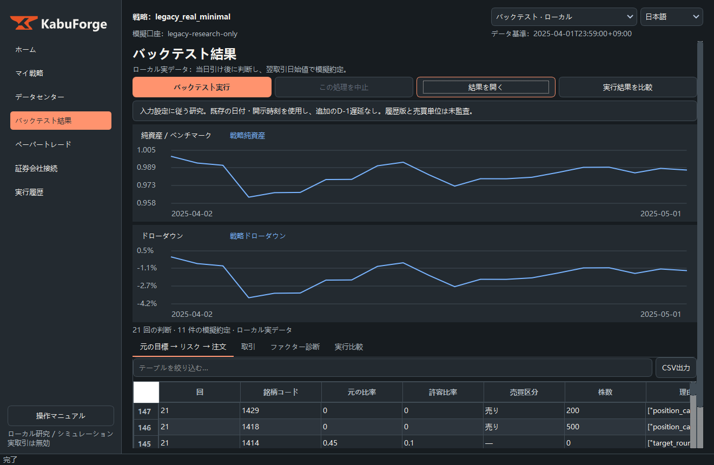
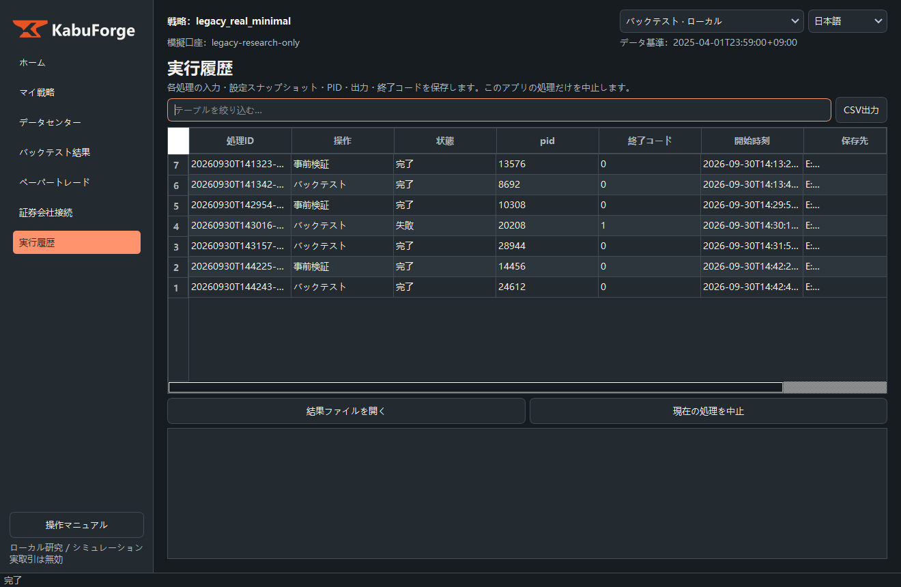
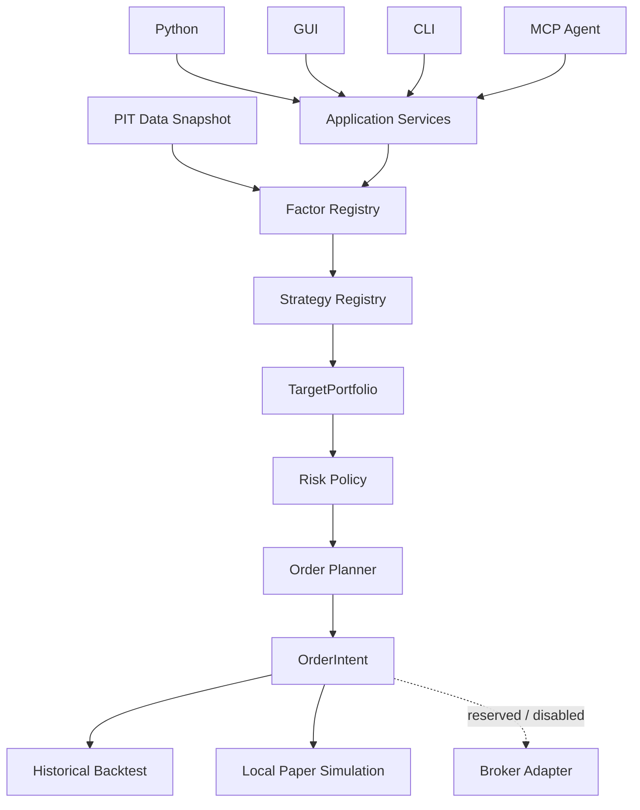

# KabuForge

[Website](https://kabuforge.com/) · [Quickstart](https://kabuforge.com/docs/quickstart/) · [Documentation](https://kabuforge.com/docs/) · [日本語](https://kabuforge.com/ja/)

[English](README.md) · [简体中文](README.zh_CN.md) · [日本語](README.ja_JP.md)

<picture>
  <source media="(prefers-color-scheme: dark)" srcset="brand/kabuforge/v2/logo-horizontal-dark.svg">
  
</picture>

**日本株の再現可能なクオンツ研究スタック。**

オープンソースでローカル優先の研究スタックです。J-Quants または明示的に選択したローカルデータから、ファクター・ML研究、バックテスト、ポートフォリオ構築、リスク管理、日本の証券会社向け中立的な注文計画までをつなぎます。

[Quick Start](#quick-start) · [Documentation](docs/ja_JP/README.md) · [Architecture](docs/ja_JP/ARCHITECTURE.md) · [現在の安定版 v0.1.1](https://github.com/Siyuan-chat/KabuForge/releases/tag/v0.1.1) · [全リリース](https://github.com/Siyuan-chat/KabuForge/releases)

現在の安定パッケージ版は **0.1.1** です。公開日は 2026-10-04 です。研究とローカルシミュレーション用で、実ブローカーへの発注は無効です。過去の GitHub `v0.1.0` Release は RC パッケージと当時の MIT ライセンスを維持しています。

<!-- KABUFORGE:VERSION:START -->
現在のパッケージ版は **0.2.0rc1** です。この候補メタデータは公開済みリリースを意味しません。研究とローカルシミュレーション用です。実端末の接続は未検証で、実注文の submit と cancel は無効です。

[](https://github.com/Siyuan-chat/KabuForge/releases)
<!-- KABUFORGE:VERSION:END -->

[](https://github.com/Siyuan-chat/KabuForge/actions/workflows/kabuforge.yml)
[](LICENSE)

## 実際の画面とワークフロー

以下は **KabuForge の既存ローカル GUI 操作記録**です。画像内の過去 NAV は、現在の公開ファクター、新しい合成 CLI demo の結果、または投資実績を示すものではありません。記録に使用した元データ、戦略設定、口座ファイルは配布されません。

[Demo の説明](docs/demos/ja_JP/index.html) · [日本語 GUI コース](docs/ja_JP/GUI_RESEARCH_COURSES.md)

<p align="center">
  
</p>

| データ | バックテスト結果 | 履歴 |
| :---: | :---: | :---: |
|  |  |  |

## KabuForge とは？

ファクターと戦略の研究を、ポートフォリオ構築、リスク制御、ブローカー中立の注文計画、過去のバックテスト、ローカル paper シミュレーションへつなぎます。Python、CLI、デスクトップ GUI、MCP agent は共通のアプリケーションサービスを利用します。

研究ノートとプロジェクトの背景：[ArcaViso](https://arcaviso.com/)。

```text
J-Quants / ローカルデータ → ファクター・ML → バックテスト → ポートフォリオ → リスク → 日本の証券会社向け計画
```

## 現在の機能

| 機能 | 状態と境界 | 証拠 |
| --- | --- | --- |
| J-Quants とローカルデータ | ユーザー自身の資格情報・データを使用。CSV、Parquet、凍結 manifest は明示的に選択します。市場データは同梱しません | [GUIコース](docs/ja_JP/GUI_RESEARCH_COURSES.md) |
| PIT 可視性ゲート | 宣言された `available_at` と意思決定時刻を検査。完全な過去 PIT 認証ではありません | [Docs](docs/ja_JP/RESEARCH_METHODOLOGY.md) |
| Factor / Strategy 拡張 | 登録・版管理された実装と必須 validator | [Docs](docs/ja_JP/FACTOR_API.md) |
| 指標 / ML / エンジン候補 | TA-Lib、pandas-ta、LightGBM、CatBoost、VectorBT、Backtrader は任意の隔離ランタイムを使用。起動可否はローカル extras に依存 | [GUIコース](docs/ja_JP/GUI_RESEARCH_COURSES.md) |
| Portfolio / Risk / Planner | 目標ポートフォリオ、リスク制約、ブローカー中立の注文意図 | [Docs](docs/ja_JP/ARCHITECTURE.md) |
| 過去バックテスト | 研究価格と執行価格の意味を分離したローカルシミュレーション | [Docs](docs/ja_JP/EXECUTION.md) |
| ローカル paper | ローカル口座・ジャーナルのシミュレーション。模擬約定は実約定ではありません | [Docs](docs/ja_JP/EXECUTION.md) |
| MCP agents | R0/R1 の検査・ローカル研究が既定。R2 paper 書き込みは明示的 opt-in | [Docs](docs/ja_JP/AGENT_API.md) |
| 日本の証券会社向け mapping / 読取専用確認 | オフライン preview はローカル処理のみ。明示的に起動する localhost 資格情報参照診断は読取専用 GET を3件実行可能。実端末の接続は未検証 | [Docs](docs/ja_JP/BROKER_API.md) |
| 実注文 | submit と cancel は無効。公開版の Regime ワークフローは既定でオフ | [Docs](docs/ja_JP/AGENT_API.md) |

基本の研究経路は **Factor → Strategy → Portfolio → Risk → Planning** です。日本株研究をローカルで確認する研究者・開発者向けです。模擬約定は実約定ではなく、完全な過去 PIT 認証ではありません。

<a id="quick-start"></a>
## クイックスタート

Python 3.12+

```shell
git clone --branch v0.1.1 --depth 1 https://github.com/Siyuan-chat/KabuForge.git
cd KabuForge
python -m pip install .
kabuforge doctor
kabuforge demo --out output/demo
kabuforge factors
kabuforge strategies
```

demo はオフラインの合成データを使用します。市場データ、J-Quants キー、ブローカー口座は不要です。GUI は `.[gui]` をインストールし、必要な場合だけ `.[analytics]`、`.[indicators]`、`.[models]`、`.[backends]` を追加します。Windows では `Launch_KabuForge.bat` を起動します。市場データと資格情報はユーザーが用意し、J-Quants 履歴は同梱されません。研究結果はすべて RESEARCH-ONLY で PIT 保証は false です。TOPIX は配当を含まない価格指数のみです。

この手順は現在の安定版に固定します。開発ブランチを使う場合は `--branch v0.1.1` を省略してください。`main` には未リリースの変更が含まれる場合があります。合成例は明示し、運用成績の証明には使いません。

GUI では **Data Center** でローカル入力を明示選択し、**Backtest Results** でレポートを確認します。**Paper Trading → Real-market historical research replay** は隔離された履歴台帳を使い、**Broker Connections → Offline cash-equity mapping preview** はローカル mapping のみを作成します。preview は注文を送信しません。読取専用診断は別の明示操作で、資格情報参照が必要です。[日本語 GUI コース](docs/ja_JP/GUI_RESEARCH_COURSES.md)、[English course](docs/en_US/GUI_RESEARCH_COURSES.md)、[中文课程](docs/zh_CN/GUI_RESEARCH_COURSES.md)を参照してください。

### Agent / MCP

ワークスペース境界内の stdio MCP サーバーを起動します。paper 書き込みには `--enable-paper` が必要で、ローカルシミュレーションのみを許可します。

```shell
kabuforge mcp --workspace output/agent_workspace
kabuforge mcp --workspace output/agent_workspace --enable-paper
```

## KabuForge を選ぶ理由

KabuForge は明示的な Factor・Strategy 契約で研究アイデアを表し、共通のアプリケーションサービスを通じてポートフォリオ、リスク、ブローカー中立の計画へつなぎます。

| 設計 | 提供する能力 |
| --- | --- |
| 拡張可能な研究 | 登録・版管理されたファクターと戦略。執行エンジンを書き換える必要はありません |
| 共通の意思決定フロー | 研究判断を執行制約と注文構築から分離 |
| 共通インターフェース | Python、GUI、CLI、MCP が同じアプリケーション契約を使用。agent にはワークスペースと実行記録の境界も適用 |
| 検査可能な判断 | 宣言された可視時刻、内容の識別情報、永続的な実行記録で検査を支援し、外部データの制限も明示 |

## 独自の Factor と Strategy を接続

```text
FactorSpec + FactorContext → FactorResult
FactorResult(s) → StrategyDecision → TargetPortfolio
```

信頼されたアプリケーションコードがファクター実装と spec validator を登録し、戦略 factory を実装 ID と版で登録します。未知・重複の識別情報は失敗し、設定から任意の Python import や eval は要求できません。戦略は登録済みファクター結果、PIT コンテキスト、状態、判断の識別情報を受け取り、目標ポートフォリオまたは再配分なしの判断を返します。その後、リスクポリシーと planner が執行制約を適用します。

[Factor 契約](docs/ja_JP/FACTOR_API.md) · [Strategy 契約](docs/ja_JP/STRATEGY_API.md)

## アーキテクチャとインターフェース



```text
Python / GUI / CLI / MCP
           ↓
   Application Services
           ↓
Research / Risk / Planning
```

共通アプリケーションサービスは検証、意思決定、計画を担当し、この境界からブローカー発注や執行台帳への書き込みは行いません。過去バックテストとローカル paper は研究・判断の意味を共有し、執行価格と模擬約定の差は明示します。MCP は R0/R1 が既定で、R2 paper 書き込みには明示的 opt-in が必要です。この RC の R3 外部アクションは無効です。

[アーキテクチャ](docs/ja_JP/ARCHITECTURE.md) · [Agent の境界](docs/ja_JP/AGENT_API.md)

## 研究の正確性

- タイムゾーン付き `available_at` で入力の可視時刻を宣言し、未来の行には意思決定時刻のゲートを適用します。
- ファクター、データ snapshot、設定の identity と意思決定・MCP 呼び出し receipts が検査を支えます。
- 研究価格で目標を決定し、後の執行価格で過去の目標を再選択しません。
- `UNKNOWN` は提出結果が不確かな場合の執行・照合契約に属します。実発注が有効という意味ではなく、無条件の再送は認められません。
- 合成例は明示し、運用成績の証明には使いません。ベンダー時刻、修訂、生存者バイアス、企業行動、ユニバース構築は別途確認が必要です。

[Research Methodology](docs/ja_JP/RESEARCH_METHODOLOGY.md) · [Architecture](docs/ja_JP/ARCHITECTURE.md) · [Factor API](docs/ja_JP/FACTOR_API.md) · [Strategy API](docs/ja_JP/STRATEGY_API.md) · [Agent API](docs/ja_JP/AGENT_API.md)

## 文書と検証

[Documentation](docs/ja_JP/README.md) · [GEO release process](docs/GEO_RELEASE_PROCESS.md) · [CI](https://github.com/Siyuan-chat/KabuForge/actions/workflows/kabuforge.yml) · [Release validation](docs/RELEASE_VALIDATION.md) · [Changelog](docs/ja_JP/CHANGELOG.md) · [Security](SECURITY.md) · [Contributing](docs/ja_JP/CONTRIBUTING.md)

## 引用

研究や技術文書では [CITATION.cff](CITATION.cff) を用いてこのリポジトリを引用してください。DOI は未取得です。

## ライセンス

現在のプロジェクト所有のコード、文書、資産は **AGPL-3.0-only** です。[LICENSE](LICENSE) と[適用範囲・保持通知](PROJECT_LICENSING.md)を参照してください。過去の tag、wheel、ソースアーカイブ、チェックサムは元のライセンスを維持し、既存の `v0.1.0-rc.1` と `v0.1.0` Release は MIT のままです。正式版 `v0.1.1` は AGPL-3.0-only です。

研究・シミュレーション用ソフトウェアで、投資助言ではありません。[DISCLAIMER.md](DISCLAIMER.md) と [SECURITY.md](SECURITY.md) を参照してください。
