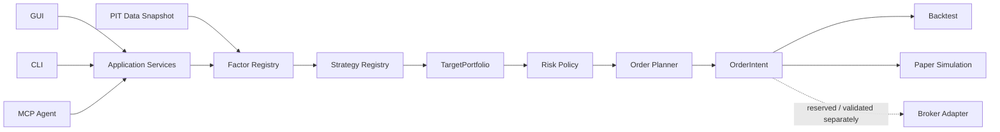

# KabuForge

[English](README.md) · [简体中文](README.zh_CN.md) · [日本語](README.ja_JP.md)

<picture>
  <source media="(prefers-color-scheme: dark)" srcset="brand/kabuforge/v1/logo-horizontal-dark.svg">
  <source media="(prefers-color-scheme: light)" srcset="brand/kabuforge/v1/logo-horizontal-light.svg">
  
</picture>

<p align="center">
  <strong>日本株のための Contract-driven / Local-first な systematic research & execution framework。</strong><br>
  自分の Factor と Strategy を定義し、再現可能な backtest / paper simulation を行い、<br>
  同じ研究コアを Python・CLI・GUI・MCP Agent から操作できます。
</p>

<p align="center">
  <a href="https://github.com/Siyuan-chat/KabuForge/releases/tag/v0.1.0-rc.1"></a>
  <a href="https://github.com/Siyuan-chat/KabuForge/actions/workflows/kabuforge.yml"></a>
  
  
  
</p>

<p align="center">
  
</p>

## なぜ KabuForge なのか

多くの個人 Quant プロジェクトは signal や backtest で終わります。KabuForge が目指すのは**研究システム**です。研究アイデアを明示的な Factor / Strategy contract として載せ、Portfolio/Risk と broker-neutral な order planning を通し、人間と Agent が同じ application service を利用できる構造にしています。

| | KabuForge の考え方 |
| --- | --- |
| **拡張可能な研究** | Factor / Strategy は engine にハードコードせず、登録・version 管理された共通 contract として扱います。Framework を書き換えずに自分の研究ロジックを追加できます。 |
| **一つの decision pipeline** | Factor → Strategy → TargetPortfolio → Risk → Planner → OrderIntent。Research logic と execution mechanics を分離します。 |
| **Agent-operable** | GUI、CLI、MCP Agent は同じ Application Services の上にあります。Agent も domain rule を迂回せずに検査・検証・backtest・比較を行います。 |
| **Auditable by design** | PIT visibility、content identity、durable receipt、idempotency、明示的な `UNKNOWN` state により研究と実行を追跡可能にします。 |

## Architecture



目標は「あらゆる環境で同じ約定」を作ることではありません。Backtest と Paper の間で**同じ研究・判断の意味論**を保ち、execution の差を明示的に扱うことです。

## 自分の Factor / Strategy を載せる

KabuForge では Factor を単なる helper function ではなく、再現可能な研究単位として扱います。

```text
FactorSpec + FactorContext
        ↓
     FactorResult
```

Strategy は登録済み Factor Result を受け取り、broker-neutral な target を生成します。

```text
FactorResult(s)
      ↓
   Strategy
      ↓
StrategyDecision
      ↓
TargetPortfolio
```

Custom implementation は承認済み Registry に登録します。設定ファイルから任意 Python import や eval を実行することはできません。そのため新しい Factor、異なる Strategy、研究設計の比較を execution engine を変更せずに試せます。

## Quick start

Python 3.12+ が必要です。

```shell
git clone https://github.com/Siyuan-chat/KabuForge.git
cd KabuForge
python -m pip install .[gui]

kabuforge doctor
kabuforge demo --out output/demo
kabuforge factors
kabuforge strategies
```

Demo は完全な synthetic / offline input を使用します。**J-Quants key、broker account、private factor、market-data cache は不要です。**

### Desktop

Windows：

```shell
Launch_KabuForge.bat
```

### Agent / MCP

ローカル stdio MCP server：

```shell
kabuforge mcp --workspace output/agent_workspace
```

R0/R1 は inspection と local research 用に既定で利用できます。Paper mutation は opt-in です。

```shell
kabuforge mcp --workspace output/agent_workspace --enable-paper
```

MCP 対応 Agent から、Strategy の検証、複数 parameter case の backtest、run comparison、evidence inspection、差分の要約などを同じ研究基盤上で実行できます。ユーザー自身が全操作を Python で書く必要はありません。

Agent の権限境界：

```text
R0  Read               enabled
R1  Local compute      enabled
R2  Local mutation     explicit opt-in
R3  External action    disabled in this RC
```

## Research から Execution へ

| Layer | RC status |
| --- | --- |
| Point-in-time Factor research | ✅ Available |
| Custom Factor / Strategy contract | ✅ Available |
| Historical backtest | ✅ Available |
| Local paper simulation | ✅ Available |
| Broker-neutral order planning | ✅ Available |
| Broker protocol mappings / mocks | 🧪 Validation layer |
| Real broker order submission | ⛔ この RC では無効 |

Paper Simulation は historical research と real-time operation の橋です。将来 real broker integration を信頼する前に、同じ Strategy semantics を real clock、account state、lot size、cash constraint、order planning に通すことができます。

## Research correctness first

KabuForge は「データが存在すること」と「decision time にそのデータが既知だったこと」を区別します。

- strict input は timezone-aware な `available_at` を使用；
- decision time より後の row は過去の判断から gate；
- Factor / Data / Config identity を再現性に含める；
- 後日の execution price で過去の Strategy target を再選択しない；
- uncertain submission は blind retry せず `UNKNOWN` として扱う；
- synthetic demo を投資実績として扱わない。

`check_point_in_time` と `check_lookahead` は visibility check であり、すべての外部 data source の完全な historical PIT certification を意味しません。

## 3つの入口、1つのCore

```text
Human ── GUI ─┐
Developer ─ CLI ─┼── Application Services ── Research / Risk / Planning
Agent ── MCP ───┘
```

Interface は変わっても、domain contract は変わりません。

## Documentation

| Topic | English | 日本語 | 简体中文 |
| --- | --- | --- | --- |
| Architecture | [EN](docs/en_US/ARCHITECTURE.md) | [JA](docs/ja_JP/ARCHITECTURE.md) | [ZH](docs/zh_CN/ARCHITECTURE.md) |
| Factor API | [EN](docs/en_US/FACTOR_API.md) | [JA](docs/ja_JP/FACTOR_API.md) | [ZH](docs/zh_CN/FACTOR_API.md) |
| Strategy API | [EN](docs/en_US/STRATEGY_API.md) | [JA](docs/ja_JP/STRATEGY_API.md) | [ZH](docs/zh_CN/STRATEGY_API.md) |
| Agent / MCP | [EN](docs/en_US/AGENT_API.md) | [JA](docs/ja_JP/AGENT_API.md) | [ZH](docs/zh_CN/AGENT_API.md) |
| Execution | [EN](docs/en_US/EXECUTION.md) | [JA](docs/ja_JP/EXECUTION.md) | [ZH](docs/zh_CN/EXECUTION.md) |
| Research methodology | [EN](docs/en_US/RESEARCH_METHODOLOGY.md) | [JA](docs/ja_JP/RESEARCH_METHODOLOGY.md) | [ZH](docs/zh_CN/RESEARCH_METHODOLOGY.md) |
| Security | [EN](docs/en_US/SECURITY.md) | [JA](docs/ja_JP/SECURITY.md) | [ZH](docs/zh_CN/SECURITY.md) |

Formal project documentation は manifest と CI により English / 日本語 / 简体中文 の3言語で維持されます。

## Release Candidate

現在の public release candidate は **v0.1.0-rc.1** です。wheel / sdist、checksum、public validation evidence を含みます。

[Release](https://github.com/Siyuan-chat/KabuForge/releases/tag/v0.1.0-rc.1) · [Validation](docs/RELEASE_VALIDATION.md) · [Roadmap](ROADMAP.md) · [Contributing](CONTRIBUTING.md)

この RC は **live broker readiness、strategy profitability、完全な historical PIT certification を主張しません。**

---

KabuForge は research / simulation software であり、投資助言ではありません。[DISCLAIMER.md](DISCLAIMER.md) と [SECURITY.md](SECURITY.md) を参照してください。
