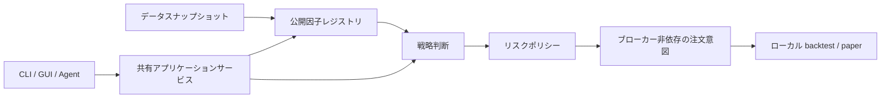

# KabuForge

[English](README.md) · [简体中文](README.zh_CN.md) · [日本語](README.ja_JP.md)


KabuForge は、日本株のローカル研究とシミュレーションのための public release candidate です。宣言的 input を検証し、登録済み公開因子を計算して戦略判断と broker-neutral な注文意図を作り、ローカル backtest 又は paper simulation を実行します。

> **Public RC — v0.1.0-rc.1。** この repository は public distribution であり private local source package ではありません。まだ candidate であり、remote CI の証拠は未実施です。live broker、strategy performance、完全な point-in-time 認証は主張しません。



## インストールと起動

KabuForge には Python 3.12 以上が必要です。

```shell
python -m pip install .[gui]
kabuforge doctor
kabuforge demo --out output/new_demo
kabuforge factors
kabuforge strategies
```

demo は synthetic/offline input を使います。Windows checkout では `Launch_KabuForge.bat` で desktop workbench を起動できます。設定は[操作ガイド](docs/OPERATIONS.md)、維持されている旧 entry point は[旧インターフェース](docs/LEGACY_README.md)を参照してください。

## CLI、GUI、Agent

- **CLI：** `doctor`、`factors`、`strategies`、`demo`、`backtest`、`paper`、`mcp` によりローカル検査と simulation を提供します。
- **GUI：** PySide6 workbench は guided configuration、preflight、ローカル simulation、run history、read-only local record を提供します。
- **Agent/MCP：** `kabuforge mcp --workspace output/agent_workspace` で開始します。R0/R1 は既定で利用でき、R2 paper mutation には `--enable-paper`、`agent_call_id`、`idempotency_key` が必要です。

## この RC に含まれるもの

- 明示 registry により選択される、独立して公開された七つの `public.*` 因子実装。
- 研究価格、執行 quote、risk policy、注文 planning を分ける shared application boundary。
- local evidence を保持する backtest、paper、deterministic simulation workflow。
- workspace bounded、schema validation、durable local call receipt を持つ JSON-RPC MCP adapter。

## 安全性と研究上の制限

KabuForge は real trading を有効化しません。`--expose-reserved-external` は approval request、submit、cancel 用の disabled future-contract stub を露出するだけで、broker に接続せず、注文の submit/cancel や取引権限付与を行いません。将来の実装には trusted broker transport、human approval authority、action-bound single-use approval、durable submission/reconciliation record が必要です。

`available_at` check は宣言された decision time に対する visibility gate にすぎません。data provenance、historical revision、survivorship、corporate action、universe construction、因子有効性、投資適合性を認証しません。

## 文書とデモ

[アーキテクチャ](docs/ARCHITECTURE.md) · [操作](docs/OPERATIONS.md) · [デモチュートリアル](docs/DEMO.md) · [Agent API](docs/ja_JP/AGENT_API.md) · [研究方法](docs/ja_JP/RESEARCH_METHODOLOGY.md) · [リリースノート](docs/RELEASE_NOTES.md) · [旧インターフェース](docs/LEGACY_README.md)

demo page には各 locale の実録 media があります：[English](docs/demos/en_US/index.html)、[简体中文](docs/demos/zh_CN/index.html)、[日本語](docs/demos/ja_JP/index.html)。これらはローカル software behavior を示すもので、market performance や live execution の証拠ではありません。


GUI extra の install 後、workbench を直接起動できます：

```shell
python -m framework_v2.workbench_qt --workspace output/workbench
```
