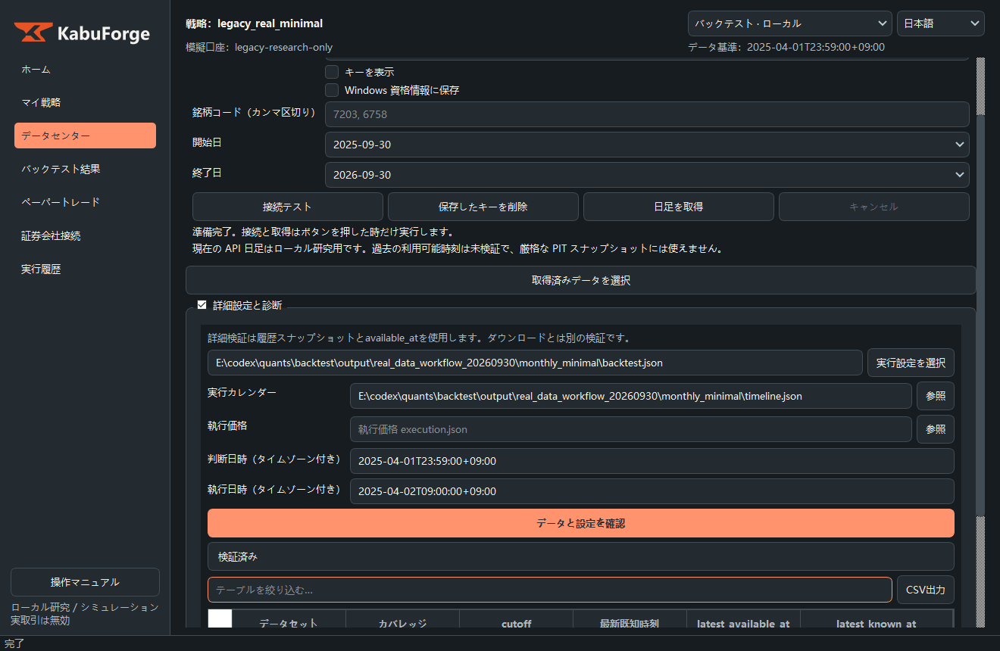

# KabuForge

[English](README.md) · [简体中文](README.zh_CN.md) · [日本語](README.ja_JP.md)

<picture>
  <source media="(prefers-color-scheme: dark)" srcset="brand/kabuforge/v2/logo-horizontal-dark.svg">
  
</picture>

**日本株の再現可能なクオンツ研究。**

日本株向けのオープンソース・ローカル優先の研究フレームワークです。ファクターと戦略の研究、バックテスト、ローカル paper シミュレーション、MCP agent インターフェースを提供します。

[Quick Start](#quick-start) · [Documentation](docs/ja_JP/README.md) · [Architecture](docs/ja_JP/ARCHITECTURE.md) · [Releases](https://github.com/Siyuan-chat/KabuForge/releases)

現在のパッケージ版は **0.1.0rc1** です。研究とローカルシミュレーション用で、実ブローカーへの発注は無効です。公開済み GitHub `v0.1.0` Release は RC パッケージと従来の MIT ライセンスを維持しています。

[](https://github.com/Siyuan-chat/KabuForge/actions/workflows/kabuforge.yml)
[](LICENSE)
[](https://github.com/Siyuan-chat/KabuForge/releases/tag/v0.1.0-rc.1)

## KabuForge とは？

ファクターと戦略の研究を、ポートフォリオ構築、リスク制御、ブローカー中立の注文計画、過去のバックテスト、ローカル paper シミュレーションへつなぎます。Python、CLI、デスクトップ GUI、MCP agent は共通のアプリケーションサービスを利用します。

```text
Factor → Strategy → TargetPortfolio → Risk → Planner → OrderIntent
```

## 現在の機能

| 機能 | 状態と境界 | 証拠 |
| --- | --- | --- |
| PIT 可視性ゲート | 宣言された `available_at` と意思決定時刻を検査。完全な過去 PIT 認証ではありません | [Docs](docs/ja_JP/RESEARCH_METHODOLOGY.md) |
| Factor / Strategy 拡張 | 登録・版管理された実装と必須 validator | [Docs](docs/ja_JP/FACTOR_API.md) |
| Portfolio / Risk / Planner | 目標ポートフォリオ、リスク制約、ブローカー中立の注文意図 | [Docs](docs/ja_JP/ARCHITECTURE.md) |
| 過去バックテスト | 研究価格と執行価格の意味を分離したローカルシミュレーション | [Docs](docs/ja_JP/EXECUTION.md) |
| ローカル paper | ローカル口座・ジャーナルのシミュレーション。模擬約定は実約定ではありません | [Docs](docs/ja_JP/EXECUTION.md) |
| MCP agents | R0/R1 の検査・ローカル研究が既定。R2 paper 書き込みは明示的 opt-in | [Docs](docs/ja_JP/AGENT_API.md) |
| ブローカー mappings / mocks | 契約と mock の検証層。実 transport は未検証 | [Docs](docs/ja_JP/BROKER_API.md) |
| 実ブローカー発注 | この RC では無効。予約済み R3 インターフェースも無効 | [Docs](docs/ja_JP/AGENT_API.md) |

<a id="quick-start"></a>
## クイックスタート

Python 3.12+

```shell
git clone https://github.com/Siyuan-chat/KabuForge.git
cd KabuForge
python -m pip install .
kabuforge doctor
kabuforge demo --out output/demo
kabuforge factors
kabuforge strategies
```

demo はオフラインの合成データを使用します。市場データ、J-Quants キー、ブローカー口座は不要です。GUI を使う場合は `.` の代わりに `.[gui]` をインストールし、Windows では `Launch_KabuForge.bat` を起動します。

### Agent / MCP

ワークスペース境界内の stdio MCP サーバーを起動します。paper 書き込みには `--enable-paper` が必要で、ローカルシミュレーションのみを許可します。

```shell
kabuforge mcp --workspace output/agent_workspace
kabuforge mcp --workspace output/agent_workspace --enable-paper
```

## 研究の正確性

- タイムゾーン付き `available_at` で入力の可視時刻を宣言し、未来の行には意思決定時刻のゲートを適用します。
- ファクター、データ snapshot、設定の identity と意思決定・MCP 呼び出し receipts が検査を支えます。
- 研究価格で目標を決定し、後の執行価格で過去の目標を再選択しません。
- `UNKNOWN` は提出結果が不確かな場合の執行・照合契約に属します。実発注が有効という意味ではなく、無条件の再送は認められません。
- 合成例は明示し、運用成績の証明には使いません。ベンダー時刻、修訂、生存者バイアス、企業行動、ユニバース構築は別途確認が必要です。

[Research Methodology](docs/ja_JP/RESEARCH_METHODOLOGY.md) · [Architecture](docs/ja_JP/ARCHITECTURE.md) · [Factor API](docs/ja_JP/FACTOR_API.md) · [Strategy API](docs/ja_JP/STRATEGY_API.md) · [Agent API](docs/ja_JP/AGENT_API.md)

## 文書と検証

[Documentation](docs/ja_JP/README.md) · [CI](https://github.com/Siyuan-chat/KabuForge/actions/workflows/kabuforge.yml) · [Release validation](docs/RELEASE_VALIDATION.md) · [Changelog](docs/ja_JP/CHANGELOG.md) · [Security](SECURITY.md) · [Contributing](docs/ja_JP/CONTRIBUTING.md)

<details>
<summary>Workflow demo / 流程演示 / フローのデモ</summary>



</details>

## 引用

研究や技術文書では [CITATION.cff](CITATION.cff) を用いてこのリポジトリを引用してください。DOI は未取得です。

## ライセンス

現在のプロジェクト所有のコード、文書、資産は **AGPL-3.0-only** です。[LICENSE](LICENSE) と[適用範囲・保持通知](LICENSE_SCOPE.md)を参照してください。過去の tag、wheel、ソースアーカイブ、チェックサムは元のライセンスを維持し、既存の `v0.1.0-rc.1` と `v0.1.0` Release は MIT のままです。今後の AGPL 配布には新しい版が必要です。

研究・シミュレーション用ソフトウェアで、投資助言ではありません。[DISCLAIMER.md](DISCLAIMER.md) と [SECURITY.md](SECURITY.md) を参照してください。
