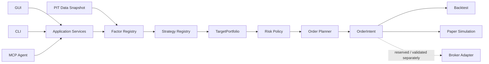

# KabuForge

[English](README.md) · [简体中文](README.zh_CN.md) · [日本語](README.ja_JP.md)

<picture>
  <source media="(prefers-color-scheme: dark)" srcset="brand/kabuforge/v1/logo-horizontal-dark.svg">
  <source media="(prefers-color-scheme: light)" srcset="brand/kabuforge/v1/logo-horizontal-light.svg">
  
</picture>

<p align="center">
  <strong>Contract-driven, local-first research and execution framework for Japanese equities.</strong><br>
  Build your own factors and strategies, run reproducible backtests and paper simulations,<br>
  and operate the same research core from Python, CLI, GUI, or MCP agents.
</p>

<p align="center">
  <a href="https://github.com/Siyuan-chat/KabuForge/releases/tag/v0.1.0-rc.1"></a>
  <a href="https://github.com/Siyuan-chat/KabuForge/actions/workflows/kabuforge.yml"></a>
  
  
  
</p>

<p align="center">
  
</p>

## Why KabuForge?

Most personal quant projects stop at a signal or a backtest. KabuForge is designed as a **research system**: ideas enter through explicit Factor and Strategy contracts, move through portfolio/risk and broker-neutral order planning, and can be inspected through the same application services from humans or agents.

| | What is different |
| --- | --- |
| **Extensible research** | Factors and strategies use registered, versioned contracts instead of being hard-coded into the engine. Bring your own research logic without rewriting the framework. |
| **One decision pipeline** | Factor → Strategy → TargetPortfolio → Risk → Planner → OrderIntent. Research logic is kept separate from execution mechanics. |
| **Agent-operable** | GUI, CLI and MCP agents sit on the same application boundary. Agents can inspect, validate, backtest and compare research without bypassing domain rules. |
| **Auditable by design** | Point-in-time visibility gates, content identities, durable receipts, idempotency and explicit `UNKNOWN` execution states make decisions inspectable and reproducible. |

## Architecture



The design goal is not “the same fills everywhere.” It is **the same research and decision semantics** across historical and paper workflows, with execution differences kept explicit.

## Bring your own Factor and Strategy

KabuForge treats a Factor as a reproducible research unit rather than a helper function:

```text
FactorSpec + FactorContext
        ↓
     FactorResult
```

Strategies consume registered factor results and produce broker-neutral targets:

```text
FactorResult(s)
      ↓
   Strategy
      ↓
StrategyDecision
      ↓
TargetPortfolio
```

Custom implementations are registered through approved registries—configuration cannot request arbitrary Python imports or evaluation. This makes it possible to explore new factors, swap strategy logic, and compare research designs without modifying the execution engine.

## Quick start

KabuForge requires Python 3.12+.

```shell
git clone https://github.com/Siyuan-chat/KabuForge.git
cd KabuForge
python -m pip install .[gui]

kabuforge doctor
kabuforge demo --out output/demo
kabuforge factors
kabuforge strategies
```

The demo is fully synthetic and offline: **no J-Quants key, broker account, private factor or market-data cache is required.**

### Desktop

On Windows:

```shell
Launch_KabuForge.bat
```

### Agent / MCP

Start the local stdio MCP server:

```shell
kabuforge mcp --workspace output/agent_workspace
```

R0/R1 tools are available by default for inspection and local research. Paper mutations are opt-in:

```shell
kabuforge mcp --workspace output/agent_workspace --enable-paper
```

An MCP-capable agent can then work through the same research platform—for example, validate a strategy, run several parameter cases, compare backtests, inspect run evidence, and summarize the differences.

Agent access is deliberately bounded:

```text
R0  Read               enabled
R1  Local compute      enabled
R2  Local mutation     explicit opt-in
R3  External action    disabled in this RC
```

## From research to execution

| Layer | RC status |
| --- | --- |
| Point-in-time factor research | ✅ Available |
| Custom Factor / Strategy contracts | ✅ Available |
| Historical backtest | ✅ Available |
| Local paper simulation | ✅ Available |
| Broker-neutral order planning | ✅ Available |
| Broker protocol mappings / mocks | 🧪 Validation layer |
| Real broker order submission | ⛔ Not enabled in this RC |

Paper simulation is the bridge between historical research and real-time operation: it lets the same strategy semantics meet clocks, account state, lot sizes, cash constraints and order planning before any future broker integration is trusted.

## Research correctness first

KabuForge explicitly separates “the data exists” from “the data was knowable at the decision time.”

- strict inputs use timezone-aware `available_at`;
- future rows are gated from earlier decisions;
- factor/data/config identities participate in reproducibility;
- later execution prices cannot reselect an earlier strategy target;
- uncertain submissions are modeled as `UNKNOWN`, not blindly retried;
- synthetic demonstrations never claim investment performance.

`check_point_in_time` and `check_lookahead` are visibility checks—not a claim that every external data source is historically PIT-complete.

## Interfaces

```text
Human ── GUI ─┐
Developer ─ CLI ─┼── Application Services ── Research / Risk / Planning
Agent ── MCP ───┘
```

The interface changes; the domain contracts do not.

## Documentation

| Topic | English | 日本語 | 简体中文 |
| --- | --- | --- | --- |
| Architecture | [EN](docs/en_US/ARCHITECTURE.md) | [JA](docs/ja_JP/ARCHITECTURE.md) | [ZH](docs/zh_CN/ARCHITECTURE.md) |
| Factor API | [EN](docs/en_US/FACTOR_API.md) | [JA](docs/ja_JP/FACTOR_API.md) | [ZH](docs/zh_CN/FACTOR_API.md) |
| Strategy API | [EN](docs/en_US/STRATEGY_API.md) | [JA](docs/ja_JP/STRATEGY_API.md) | [ZH](docs/zh_CN/STRATEGY_API.md) |
| Agent / MCP | [EN](docs/en_US/AGENT_API.md) | [JA](docs/ja_JP/AGENT_API.md) | [ZH](docs/zh_CN/AGENT_API.md) |
| Execution | [EN](docs/en_US/EXECUTION.md) | [JA](docs/ja_JP/EXECUTION.md) | [ZH](docs/zh_CN/EXECUTION.md) |
| Research methodology | [EN](docs/en_US/RESEARCH_METHODOLOGY.md) | [JA](docs/ja_JP/RESEARCH_METHODOLOGY.md) | [ZH](docs/zh_CN/RESEARCH_METHODOLOGY.md) |
| Security | [EN](docs/en_US/SECURITY.md) | [JA](docs/ja_JP/SECURITY.md) | [ZH](docs/zh_CN/SECURITY.md) |

All formal project documentation is maintained in English, Japanese and Simplified Chinese through a documented manifest and CI checks.

## Release candidate

**v0.1.0-rc.1** is the current public release candidate. It includes wheel/sdist artifacts, checksums and public validation evidence.

[Release notes](https://github.com/Siyuan-chat/KabuForge/releases/tag/v0.1.0-rc.1) · [Release validation](docs/RELEASE_VALIDATION.md) · [Roadmap](ROADMAP.md) · [Contributing](CONTRIBUTING.md)

The RC does **not** claim live-broker readiness, strategy profitability, or complete historical PIT certification.

---

KabuForge is research and simulation software, not investment advice. See [DISCLAIMER.md](DISCLAIMER.md) and [SECURITY.md](SECURITY.md).
