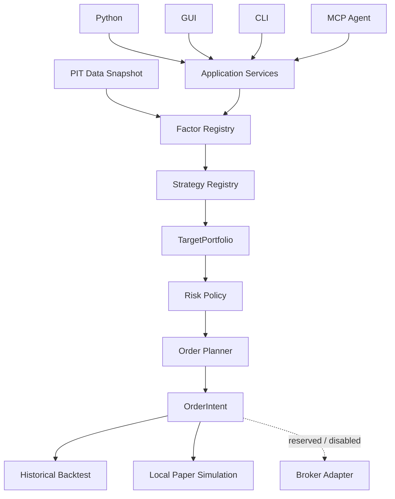

<div align="center">

<picture>
  <source media="(prefers-color-scheme: dark)" srcset="brand/kabuforge/v2/logo-horizontal-dark.svg">
  
</picture>

**Open-source Japanese equity quant research — local-first, reproducible, agent-compatible.**

KabuForge connects **J-Quants or explicit local data** to **factor & ML research, backtesting, portfolio construction, risk controls, local paper simulation, and broker-neutral planning**.

[Website](https://kabuforge.com/) · [Quickstart](https://kabuforge.com/docs/quickstart/) · [Documentation](https://kabuforge.com/docs/) · [Architecture](docs/en_US/ARCHITECTURE.md) · [Stable release v0.1.1](https://github.com/Siyuan-chat/KabuForge/releases/tag/v0.1.1)

Current stable package version: **0.1.1**. Published 2026-10-04. Research and local simulation only; real broker order submission is disabled.

[](https://github.com/Siyuan-chat/KabuForge/releases/tag/v0.1.1)
[](https://github.com/Siyuan-chat/KabuForge/actions/workflows/kabuforge.yml)
[](pyproject.toml)
[](LICENSE)

</div>

[English](README.md) · [简体中文](README.zh_CN.md) · [日本語](README.ja_JP.md)

## Current GUI

These screenshots come from the **current GUI research course** captured from the public-candidate Qt source checkout. They show the newer interface used by the current documentation; they are public-source captures, not performance claims or clean-wheel certification. Research outputs remain **RESEARCH-ONLY** with `pit_guarantee=false`.

[Current GUI research course](docs/en_US/GUI_RESEARCH_COURSES.md) · [Current evidence summary](docs/demos/research-20261006/EVIDENCE_SUMMARY.md)

<p align="center">
  
</p>

| Data Center · frozen input | Backtest Results |
| :---: | :---: |
|  |  |
| **Historical Paper · full replay** | **Broker Connections · offline mapping** |
|  |  |

## What is KabuForge?

KabuForge is an open-source Python research stack for **Japanese equity quantitative research**. It connects **J-Quants or explicitly selected local data** to factor and ML research, historical backtesting, portfolio construction, risk controls, local paper simulation, and Japanese broker-neutral order planning.

```text
J-Quants / local data → Factor + ML → Backtest → Portfolio → Risk → Japanese broker planning
```

| Research | Reproduce | Integrate |
| --- | --- | --- |
| Versioned factors, strategies, indicators and ML candidates | Explicit data inputs, decision-time visibility gates, durable identities and receipts | Python, CLI, desktop GUI and workspace-bounded MCP agents |
| Portfolio targets and risk constraints | Historical backtests and local paper simulation with explicit execution semantics | Broker-neutral planning with real submit/cancel disabled |

KabuForge is built for researchers and developers who want a local, inspectable workflow for Japanese-equity factor research and backtesting. **Research and local simulation only:** real broker order submission/cancel remain disabled, and no complete historical PIT certification is claimed.

Research notes and project context: [ArcaViso](https://arcaviso.com/).

<a id="quick-start"></a>
## Quick start

Python 3.12+

```shell
git clone --branch v0.1.1 --depth 1 https://github.com/Siyuan-chat/KabuForge.git
cd KabuForge
python -m pip install .
kabuforge doctor
kabuforge demo --out output/demo
kabuforge factors
kabuforge strategies
```

The demo is synthetic and offline: no market data, J-Quants key or broker account is needed. Install `.[gui]` for the optional desktop GUI; install `.[analytics]`, `.[indicators]`, `.[models]` or `.[backends]` only for workflows that need those optional runtimes. On Windows launch `Launch_KabuForge.bat`. Users provide their own data and credentials; the package does not bundle J-Quants history. All research outputs are RESEARCH-ONLY with no PIT guarantee. TOPIX is a price-only reference without dividends.

This command pins the current stable release. To use the moving development branch, omit `--branch v0.1.1`; `main` can contain unreleased changes.

In the GUI, use **Data Center** for explicitly selected local inputs, **Backtest Results** for reports, **Paper Trading → Real-market historical research replay** for isolated historical replay, and **Broker Connections → Offline cash-equity mapping preview** for local mapping. The preview does not submit orders; read-only diagnostics require a separate explicit action and a credential reference. See the [English GUI courses](docs/en_US/GUI_RESEARCH_COURSES.md), [中文课程](docs/zh_CN/GUI_RESEARCH_COURSES.md), and [日本語コース](docs/ja_JP/GUI_RESEARCH_COURSES.md).

### Agent / MCP

Start a workspace-bounded stdio MCP server. Paper mutations require `--enable-paper`; this grants only local simulation access.

```shell
kabuforge mcp --workspace output/agent_workspace
kabuforge mcp --workspace output/agent_workspace --enable-paper
```

## Why KabuForge?

KabuForge keeps research ideas in explicit Factor and Strategy contracts, then connects them to portfolio, risk and broker-neutral planning through shared application services.

| Design | What it enables |
| --- | --- |
| Extensible research | Registered, versioned factors and strategies without rewriting the execution engine |
| One decision pipeline | Research decisions remain separate from execution constraints and order construction |
| Shared interfaces | Python, GUI, CLI and MCP use the same application contracts; agent access adds workspace and receipt boundaries |
| Inspectable decisions | Declared visibility times, content identities and durable receipts support review, with external-data limits kept explicit |

## Architecture and interfaces



```text
Python / GUI / CLI / MCP
           ↓
   Application Services
           ↓
Research / Risk / Planning
```

Shared application services validate, decide and plan; this boundary does not submit broker orders or write an execution ledger. Historical and local paper workflows share research and decision semantics while their execution prices and simulated fills remain explicit. R0/R1 MCP tools are enabled by default, R2 paper writes require opt-in, and R3 external actions remain disabled in this RC.

[Architecture](docs/en_US/ARCHITECTURE.md) · [Agent boundaries](docs/en_US/AGENT_API.md)

## Current capabilities and boundaries

| Capability | Status and boundary | Evidence |
| --- | --- | --- |
| J-Quants and local data | User-supplied credentials/data only; local CSV, Parquet and frozen manifests are explicit inputs. No market data ships in this package | [GUI courses](docs/en_US/GUI_RESEARCH_COURSES.md) |
| PIT visibility gates | Checks declared `available_at` against decision time; no complete historical PIT certification | [Docs](docs/en_US/RESEARCH_METHODOLOGY.md) |
| Factor / Strategy extensions | Registered, versioned implementations and required validators | [Docs](docs/en_US/FACTOR_API.md) |
| Indicators / ML / engine candidates | Optional isolated runtimes for TA-Lib, pandas-ta, LightGBM, CatBoost, VectorBT and Backtrader; runtime launchability depends on local extras | [GUI courses](docs/en_US/GUI_RESEARCH_COURSES.md) |
| Portfolio / Risk / Planner | Targets, risk constraints and broker-neutral order intents | [Docs](docs/en_US/ARCHITECTURE.md) |
| Historical backtest | Local simulation with explicit research and execution price semantics | [Docs](docs/en_US/EXECUTION.md) |
| Local paper | Local account/journal simulation; simulated fills are not broker fills | [Docs](docs/en_US/EXECUTION.md) |
| MCP agents | R0/R1 inspection and local research by default; R2 paper writes require explicit opt-in | [Docs](docs/en_US/AGENT_API.md) |
| Japanese broker mapping / read-only check | Offline preview is local-only; an explicit localhost credential-reference diagnostic can issue three read-only GETs. Actual terminal connectivity remains unverified | [Docs](docs/en_US/BROKER_API.md) |
| Real broker orders | Submit and cancel are disabled. Public Regime workflow is off by default | [Docs](docs/en_US/AGENT_API.md) |

The core research path is **Factor → Strategy → Portfolio → Risk → Planning**. KabuForge is for researchers and developers who inspect Japanese-equity research locally. Simulated fills are not broker fills, and there is no complete historical PIT certification.

## Bring your own Factor and Strategy

```text
FactorSpec + FactorContext → FactorResult
FactorResult(s) → StrategyDecision → TargetPortfolio
```

Trusted application code registers factor implementations with spec validators, and strategy factories by implementation ID and version. Unknown or duplicate identities fail; configuration cannot request arbitrary Python imports or evaluation. Strategies receive registered factor results, PIT context, state and decision identity, then return a target or no-rebalance decision. Risk policy and the planner apply execution constraints afterwards.

[Factor contracts](docs/en_US/FACTOR_API.md) · [Strategy contracts](docs/en_US/STRATEGY_API.md)

## Research correctness

- Timezone-aware `available_at` declares when an input became visible; future rows require a decision-time gate.
- Factor, data snapshot and configuration identities make a run inspectable; decision and MCP call receipts retain evidence.
- Research prices select targets; later execution prices must not reselect an earlier target.
- `UNKNOWN` belongs to the execution/reconciliation contract for uncertain submission outcomes. It is not proof that live broker submission is enabled, and must not trigger a blind retry.
- Synthetic examples are labeled and do not establish performance. Vendor timing, revisions, survivorship, corporate actions and universe construction still need separate checks.

[Research Methodology](docs/en_US/RESEARCH_METHODOLOGY.md) · [Architecture](docs/en_US/ARCHITECTURE.md) · [Factor API](docs/en_US/FACTOR_API.md) · [Strategy API](docs/en_US/STRATEGY_API.md) · [Agent API](docs/en_US/AGENT_API.md)

## Development status

The current stable release is **v0.1.1**, published 2026-10-04 under AGPL-3.0-only. For reproducible use, pin the stable tag as shown in the Quick start. The `main` branch can contain unreleased work.

<!-- KABUFORGE:VERSION:START -->
Current package version: **0.2.0rc1**. This candidate metadata does not mean the version has been released. Research and local simulation only; actual terminal connectivity is unverified, and real order submission/cancel remain disabled.

[](https://github.com/Siyuan-chat/KabuForge/releases)
<!-- KABUFORGE:VERSION:END -->

## Documentation and validation

[Documentation](docs/en_US/README.md) · [GEO release process](docs/GEO_RELEASE_PROCESS.md) · [CI](https://github.com/Siyuan-chat/KabuForge/actions/workflows/kabuforge.yml) · [Release validation](docs/RELEASE_VALIDATION.md) · [Changelog](docs/en_US/CHANGELOG.md) · [Security](SECURITY.md) · [Contributing](docs/en_US/CONTRIBUTING.md)

## Citation

For research or technical writing, cite this repository using [CITATION.cff](CITATION.cff). No DOI is assigned.

## License

Current project-owned code, documentation and assets are licensed under **AGPL-3.0-only**. See [LICENSE](LICENSE) and [licensing scope and retained notices](PROJECT_LICENSING.md). Historical tags, wheels, source archives and checksums retain their original licenses; the existing `v0.1.0-rc.1` and `v0.1.0` Releases remain MIT. Release `v0.1.1` uses AGPL-3.0-only.

Research and simulation software; not investment advice. See [DISCLAIMER.md](DISCLAIMER.md) and [SECURITY.md](SECURITY.md).
