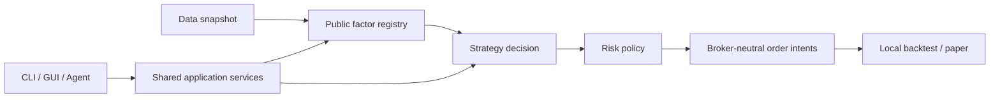

# KabuForge

[English](README.md) · [简体中文](README.zh_CN.md) · [日本語](README.ja_JP.md)


KabuForge is a public release candidate for local Japanese-equity research and simulation. It validates declarative inputs, computes registered public factors, builds strategy decisions, plans broker-neutral order intents, and runs local backtest or paper simulations.

> **Public RC — v0.1.0-rc.1.** This repository is the public distribution, not the private local source package. It remains a release candidate: remote CI evidence and checksums are available in the [GitHub release](https://github.com/Siyuan-chat/KabuForge/releases/tag/v0.1.0-rc.1) and no live-broker, strategy-performance, or complete point-in-time certification is claimed.



## Install and start

KabuForge requires Python 3.12 or newer.

```shell
python -m pip install .[gui]
kabuforge doctor
kabuforge demo --out output/new_demo
kabuforge factors
kabuforge strategies
```

The demo uses synthetic, offline inputs. To start the desktop workbench from a checkout, run `Launch_KabuForge.bat` on Windows. See the [operations guide](docs/OPERATIONS.md) for setup and the [legacy interface guide](docs/LEGACY_README.md) for retained earlier entry points.

## CLI, GUI, and Agent

- **CLI:** `doctor`, `factors`, `strategies`, `demo`, `backtest`, `paper`, and `mcp` provide local inspection and simulation paths.
- **GUI:** the PySide6 workbench provides guided configuration, preflight, local simulations, run history, and read-only local records.
- **Agent/MCP:** start with `kabuforge mcp --workspace output/agent_workspace`. R0/R1 tools are available by default. R2 paper mutations require `--enable-paper`, an `agent_call_id`, and an `idempotency_key`.

```shell
kabuforge mcp --workspace output/agent_workspace
kabuforge mcp --workspace output/agent_workspace --enable-paper
```

## What this RC includes

- Seven independently published `public.*` factor implementations, selected through explicit registries.
- A shared application boundary separating research marks, execution quotes, risk policy, and order planning.
- Local backtest, paper, and deterministic simulation workflows with retained local evidence.
- A workspace-bounded JSON-RPC MCP adapter with schema validation and durable local call receipts.
- English, Simplified Chinese, and Japanese documentation and demo media.

## Safety and research limits

KabuForge does not enable real trading. `--expose-reserved-external` only exposes disabled future-contract stubs for approval request, order submission, and cancellation. It does not connect a broker, submit or cancel an order, or grant trading authority. A future implementation needs a trusted broker transport, human approval authority, action-bound single-use approval, and durable submission/reconciliation records.

`available_at` checks are visibility gates for a declared decision time. They do not certify data provenance, historical revisions, survivorship, corporate actions, universe construction, factor efficacy, or investment suitability.

## Documentation and demos

[Architecture](docs/ARCHITECTURE.md) · [Operations](docs/OPERATIONS.md) · [Demo tutorial](docs/DEMO.md) · [Agent API](docs/en_US/AGENT_API.md) · [Research methodology](docs/en_US/RESEARCH_METHODOLOGY.md) · [Release notes](docs/RELEASE_NOTES.md) · [Legacy interface](docs/LEGACY_README.md)

The demo pages include genuine recorded media for each locale: [English](docs/demos/en_US/index.html), [简体中文](docs/demos/zh_CN/index.html), and [日本語](docs/demos/ja_JP/index.html). These demonstrations show local software behavior; they are not evidence of market performance or live execution.


Installed GUI entry point (with the GUI extra):

```shell
python -m framework_v2.workbench_qt --workspace output/workbench
```
