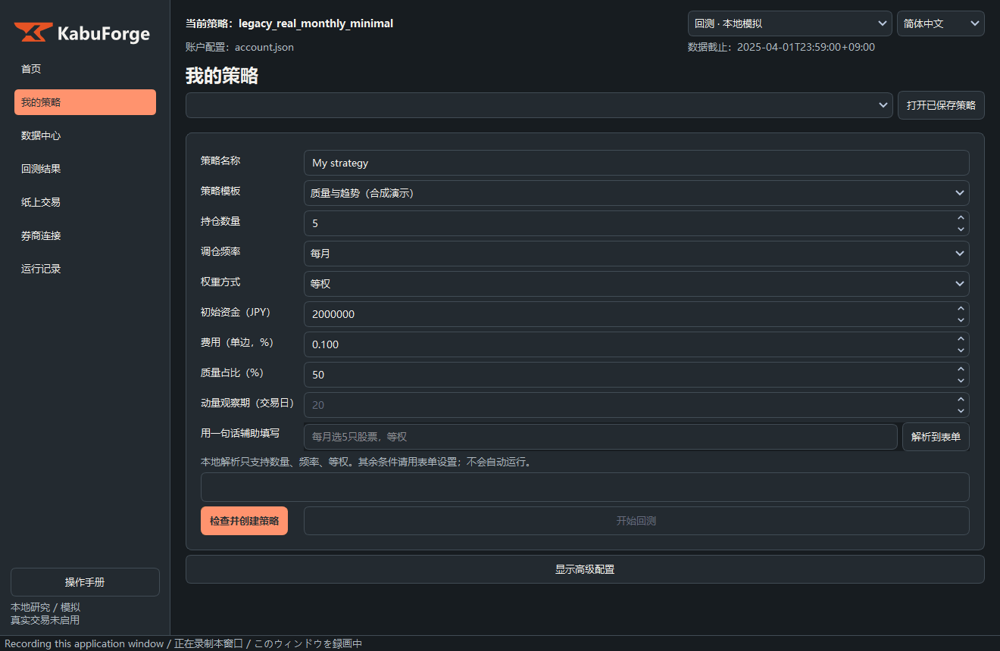

# KabuForge · JP Equity Backtest Console

[简体中文](README.md) · [日本語](README.ja.md) · [English](README.en.md)


**用于日股研究、可复现模拟与执行记录核查的本地桌面工作台。**

KabuForge 是本仓库的新一代研究工作台：中文／日本語／English 三语界面、引导式策略表单、离线手册、公开因子、严格数据身份检查，以及分离信号与成交的模拟引擎。仓库原名 `JP-Equity-Backtest-Console`，现名 `KabuForge`，旧链接由 GitHub 自动跳转。旧版 GUI / CLI 仍保留，见 [旧版说明](docs/LEGACY_README.md)。

本发布仅使用本仓库 `factors/` 内已有的**公开因子**。标准 12-1 动量使用 `public.momentum_12_1` 身份；不包含、导入或代替作者的私有残差动量及其他私有因子。没有市场数据、账户记录或凭据随代码发布。

## 快速开始

Windows：Python 3.12、PowerShell 7。在仓库根目录运行：

```powershell
py -3.12 -m venv .venv-gui
.\.venv-gui\Scripts\python.exe -m pip install -r framework_v2/requirements-gui.txt
.\Launch_KabuForge.bat
```

安装后，双击 `Launch_KabuForge.bat` 即可启动。进入首页后选择离线演示，再创建策略、运行模拟、查看结果。启动器本身不会安装依赖。旧入口 `start_here.bat` 继续启动旧版 GUI。

也可直接运行：

```powershell
.\.venv-gui\Scripts\python.exe -B -m framework_v2.workbench_qt --workspace output/my_workspace
```

## 操作演示

沿用本地已有的中文操作演示，GIF 与截图保持原样。它展示历史研究流程，曲线不代表本次公开因子的结果；演示不附原始行情、策略配置或账本。



[中文操作截图集](docs/demos/zh_CN/index.html)

## 文档

| 内容 | 入口 |
| --- | --- |
| 安装、启动与操作 | [操作指南](docs/OPERATIONS.md) |
| 一步步离线演示 | [演示教程](docs/DEMO.md) |
| 模块、数据流与执行边界 | [详细架构](docs/ARCHITECTURE.md) |
| 引擎接口与限制 | [引擎文档](framework_v2/README.md) |
| 离线完整手册 | [中文](framework_v2/docs/manual_zh_CN.html) |
| 本次发布的验证 | [验证记录](docs/RELEASE_VALIDATION.md) |
| 旧版配置与操作 | [旧版 README](docs/LEGACY_README.md) |

HTML 手册请下载仓库后用浏览器打开，或在工作台按 F1；GitHub 文件页显示源代码。

## 离线命令行演示

以下命令在仓库根目录运行；每次使用全新输出目录。

```powershell
.\.venv-gui\Scripts\python.exe -B -m framework_v2.cli demo --out output/demo
.\.venv-gui\Scripts\python.exe -B -m framework_v2.cli validate output/demo/backtest.json
.\.venv-gui\Scripts\python.exe -B -m framework_v2.cli history output/demo/backtest.json --timeline output/demo/timeline.json --out output/history
```

`demo` 检查 backtest、paper、fake 三种模式的订单意图一致性，不发送订单。`history` 生成本地模拟的净值、订单、成交及日志。演示使用合成输入，没有真实收益证明。

## 引擎特性

- 配置图、数据快照和因子实现均绑定身份及内容哈希。
- 因子仅读取决策时刻 `available_at` 已知的数据；当前 API 下载结果不会自动取得历史 PIT 证明。
- 信号、风险约束、数量规划与模拟成交分层；事后执行价格不用于重选历史目标。
- SQLite 事务记录订单、事件、成交、账户版本与决策证据；未知订单状态阻止盲目重发。
- 三语界面、离线全文搜索手册、可重开策略草稿、运行记录和只读账本。
- J-Quants v2 数据下载支持分页、取消、续传及本地完整性检查；用户自行提供访问资格。

## 范围与限制

软件用于研究和模拟，不是投资建议或实盘交易系统。真实券商连接、Excel 本机集成、历史任务自动恢复及策略有效性认证尚未交付。协议适配代码和 mock 测试不代表可用的真实券商连接。

下载日线后的简化价格研究与严格 PIT 引擎有不同的数据契约。前者使用连续份额，不包含完整整手、滑点、股息或容量审计。完整旧组合/regime 算法不宣称等价迁移。详见 [DISCLAIMER](DISCLAIMER.md) 和 [LICENSE](LICENSE)。

## 开发验证

```powershell
.\.venv-gui\Scripts\python.exe -B -m unittest discover -s framework_v2/tests -q
.\.venv-gui\Scripts\python.exe -B -m framework_v2.capture_acceptance --output output/gui_acceptance
```

验收脚本使用 Qt 离屏控件和合成/mock 输入，不是原生鼠标自动化、真实 API 权限测试或实盘认证。
