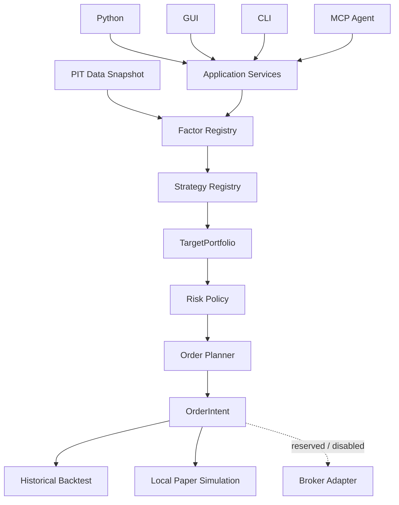

# KabuForge

[Website](https://kabuforge.com/) · [Quickstart](https://kabuforge.com/docs/quickstart/) · [Documentation](https://kabuforge.com/docs/) · [日本語](https://kabuforge.com/ja/)

[English](README.md) · [简体中文](README.zh_CN.md) · [日本語](README.ja_JP.md)

<picture>
  <source media="(prefers-color-scheme: dark)" srcset="brand/kabuforge/v2/logo-horizontal-dark.svg">
  
</picture>

**面向日本股票的可复现量化研究全链路。**

开源、本地优先的研究栈，将 J-Quants 或显式选择的本地数据连接到因子与机器学习研究、回测、组合构建、风险控制及日本券商中立规划。

[Quick Start](#quick-start) · [Documentation](docs/zh_CN/README.md) · [Architecture](docs/zh_CN/ARCHITECTURE.md) · [当前稳定版 v0.1.1](https://github.com/Siyuan-chat/KabuForge/releases/tag/v0.1.1) · [全部发行](https://github.com/Siyuan-chat/KabuForge/releases)

当前稳定包版本为 **0.1.1**。发布于 2026-10-04。仅用于研究与本地模拟，真实券商下单未启用。历史 GitHub `v0.1.0` Release 保留 RC 包附件及该版本当时采用的 MIT 许可。

<!-- KABUFORGE:VERSION:START -->
当前包版本为 **0.2.0rc1**。这是候选元数据，不表示该版本已发布。本项目用于研究与本地模拟；真实终端连通性尚未验证，真实订单提交与撤销保持禁用。

[](https://github.com/Siyuan-chat/KabuForge/releases)
<!-- KABUFORGE:VERSION:END -->

[](https://github.com/Siyuan-chat/KabuForge/actions/workflows/kabuforge.yml)
[](LICENSE)

## 当前 GUI

以下截图来自**当前 GUI 研究课程**，由公开候选源码的 Qt 界面实际截取，反映新版界面，而不是旧版历史 demo。截图用于说明工作流，不代表投资表现，也不等同于 clean-wheel 安装认证；研究输出仍为 **RESEARCH-ONLY**，`pit_guarantee=false`。

[当前中文 GUI 课程](docs/zh_CN/GUI_RESEARCH_COURSES.md) · [当前证据摘要](docs/demos/research-20261006/EVIDENCE_SUMMARY.md)

<p align="center">
  
</p>

| 数据中心 · 冻结输入 | 回测结果 |
| :---: | :---: |
|  |  |
| **历史 Paper · 全量回放** | **券商连接 · 离线映射** |
|  |  |

## KabuForge 是什么？

KabuForge 将因子与策略研究连接到组合构建、风险控制、券商中立订单规划、历史回测和本地纸上模拟。Python、CLI、桌面 GUI 与 MCP agent 共用同一应用服务。

研究笔记和项目背景：[ArcaViso](https://arcaviso.com/)。

```text
J-Quants / 本地数据 → 因子与机器学习 → 回测 → 组合 → 风险 → 日本券商规划
```

## 当前能力

| 能力 | 状态与边界 | 证据 |
| --- | --- | --- |
| J-Quants 与本地数据 | 使用用户自己的凭证和数据；CSV、Parquet、冻结 manifest 均须显式选择。软件包不附带行情 | [GUI课程](docs/zh_CN/GUI_RESEARCH_COURSES.md) |
| PIT 可见性门控 | 检查声明的 `available_at` 与决策时间；不代表完整历史 PIT 认证 | [Docs](docs/zh_CN/RESEARCH_METHODOLOGY.md) |
| Factor / Strategy 扩展 | 注册、版本化实现与必需 validator | [Docs](docs/zh_CN/FACTOR_API.md) |
| 指标 / ML / 引擎候选 | TA-Lib、pandas-ta、LightGBM、CatBoost、VectorBT、Backtrader 使用可选隔离运行时；能否启动取决于本地 extras | [GUI课程](docs/zh_CN/GUI_RESEARCH_COURSES.md) |
| Portfolio / Risk / Planner | 目标组合、风险约束与券商中立订单意图 | [Docs](docs/zh_CN/ARCHITECTURE.md) |
| 历史回测 | 本地模拟，明确研究价与执行价语义 | [Docs](docs/zh_CN/EXECUTION.md) |
| 本地纸上模拟 | 本地账户与日志模拟；模拟成交不等于券商成交 | [Docs](docs/zh_CN/EXECUTION.md) |
| MCP agents | 默认 R0/R1 检查和本地研究；R2 paper 写入必须显式启用 | [Docs](docs/zh_CN/AGENT_API.md) |
| 日本券商映射 / 只读检查 | 离线预览仅本地处理；明确触发的 localhost 凭证引用诊断可执行三个只读 GET。真实终端连通性仍未验证 | [Docs](docs/zh_CN/BROKER_API.md) |
| 真实券商订单 | 提交与撤销均禁用；公开版 Regime 流程默认关闭 | [Docs](docs/zh_CN/AGENT_API.md) |

核心研究流程是 **Factor → Strategy → Portfolio → Risk → Planning**，服务于希望在本地检查日本股票研究的研究者与开发者。模拟成交不等于券商成交，不代表完整历史 PIT 认证。真实券商下单未启用。

<a id="quick-start"></a>
## 快速开始

Python 3.12+

```shell
git clone --branch v0.1.1 --depth 1 https://github.com/Siyuan-chat/KabuForge.git
cd KabuForge
python -m pip install .
kabuforge doctor
kabuforge demo --out output/demo
kabuforge factors
kabuforge strategies
```

demo 使用离线合成数据，无需市场数据、J-Quants 密钥或券商账户。桌面 GUI 安装 `.[gui]`；仅在需要相应流程时再安装 `.[analytics]`、`.[indicators]`、`.[models]` 或 `.[backends]`。Windows 可启动 `Launch_KabuForge.bat`。行情与凭证由用户自行提供，包内没有 J-Quants 历史数据。研究输出均为 RESEARCH-ONLY，PIT 保证为 false。TOPIX 仅作价格指数参考，不含股息。

此命令固定到当前稳定版。若使用开发分支，请省略 `--branch v0.1.1`；`main` 可能包含尚未发行的改动。合成示例须明确标识，不能证明绩效。

GUI 中通过 **数据中心** 显式选择本地输入，在 **回测结果** 查看报告；**纸上交易 → 真实行情历史研究模拟** 使用隔离历史账本；**券商连接 → 离线现金股票映射预览** 仅生成本地映射。预览不提交订单；只读诊断是单独的显式操作，并需凭证引用。查看[中文 GUI 课程](docs/zh_CN/GUI_RESEARCH_COURSES.md)、[English course](docs/en_US/GUI_RESEARCH_COURSES.md)和[日本語コース](docs/ja_JP/GUI_RESEARCH_COURSES.md)。

### Agent / MCP

启动受工作区边界约束的 stdio MCP 服务。paper 写入须加 `--enable-paper`，仅开放本地模拟权限。

```shell
kabuforge mcp --workspace output/agent_workspace
kabuforge mcp --workspace output/agent_workspace --enable-paper
```

## 为什么选择 KabuForge？

KabuForge 用明确的 Factor 和 Strategy 契约承载研究想法，再通过共享应用服务连接组合、风险与券商中立规划。

| 设计 | 带来的能力 |
| --- | --- |
| 可扩展研究 | 注册、版本化的因子与策略，无需重写执行引擎 |
| 统一决策流程 | 研究决策与执行约束、订单构建保持分离 |
| 共享接口 | Python、GUI、CLI、MCP 使用同一应用契约；agent 另受工作区与回执边界约束 |
| 可检查决策 | 声明的可见时间、内容身份与持久回执支持审查，同时明确外部数据限制 |

## 接入自己的 Factor 与 Strategy

```text
FactorSpec + FactorContext → FactorResult
FactorResult(s) → StrategyDecision → TargetPortfolio
```

可信应用代码注册因子实现及 spec validator，并按实现 ID 和版本注册策略 factory。未知或重复身份会失败；配置不能请求任意 Python import 或 eval。策略接收已注册因子结果、PIT 上下文、状态与决策身份，返回目标组合或不再平衡决策；随后由风险策略与 planner 应用执行约束。

[Factor 契约](docs/zh_CN/FACTOR_API.md) · [Strategy 契约](docs/zh_CN/STRATEGY_API.md)

## 架构与接口



```text
Python / GUI / CLI / MCP
           ↓
   Application Services
           ↓
Research / Risk / Planning
```

共享应用服务负责验证、决策与规划；这一边界不向券商下单，也不写执行账本。历史回测与本地纸上流程共享研究及决策语义，同时明确执行价格与模拟成交的差异。MCP 默认启用 R0/R1，R2 paper 写入须显式启用，当前 RC 的 R3 外部动作保持禁用。

[架构](docs/zh_CN/ARCHITECTURE.md) · [Agent 边界](docs/zh_CN/AGENT_API.md)

## 研究正确性

- 带时区的 `available_at` 声明输入何时可见；未来记录须通过决策时间门控。
- 因子、数据快照与配置身份支持检查运行来源；决策与 MCP 调用 receipts 保留证据。
- 研究价格决定目标；之后的执行价格不得重新选择此前的目标。
- `UNKNOWN` 属于执行与对账契约，表示提交结果不确定；不代表已启用真实券商提交，不得据此盲目重试。
- 合成示例须明确标识，不能证明绩效。供应商时间、历史修订、幸存者偏差、公司行为和股票池构建仍须另外核验。

[Research Methodology](docs/zh_CN/RESEARCH_METHODOLOGY.md) · [Architecture](docs/zh_CN/ARCHITECTURE.md) · [Factor API](docs/zh_CN/FACTOR_API.md) · [Strategy API](docs/zh_CN/STRATEGY_API.md) · [Agent API](docs/zh_CN/AGENT_API.md)

## 文档与验证

[Documentation](docs/zh_CN/README.md) · [发行流程](docs/GEO_RELEASE_PROCESS.md) · [CI](https://github.com/Siyuan-chat/KabuForge/actions/workflows/kabuforge.yml) · [Release validation](docs/RELEASE_VALIDATION.md) · [Changelog](docs/zh_CN/CHANGELOG.md) · [Security](SECURITY.md) · [Contributing](docs/zh_CN/CONTRIBUTING.md)

## 引用

用于研究或技术写作时，请按 [CITATION.cff](CITATION.cff) 引用本仓库。项目未分配 DOI。

## 许可证

当前项目自有代码、文档与资产采用 **AGPL-3.0-only**。见 [LICENSE](LICENSE) 及[许可范围与保留通知](PROJECT_LICENSING.md)。历史 tag、wheel、源码包和校验和保持原许可；既有 `v0.1.0-rc.1` 与 `v0.1.0` Release 仍为 MIT。正式版 `v0.1.1` 采用 AGPL-3.0-only。

本软件用于研究与模拟，不构成投资建议。见 [DISCLAIMER.md](DISCLAIMER.md) 与 [SECURITY.md](SECURITY.md)。
