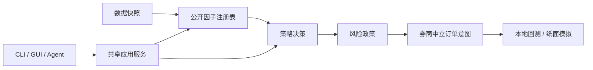

# KabuForge

[English](README.md) · [简体中文](README.zh_CN.md) · [日本語](README.ja_JP.md)

<picture>
  <source media="(prefers-color-scheme: dark)" srcset="brand/kabuforge/v1/logo-horizontal-dark.svg">
  <source media="(prefers-color-scheme: light)" srcset="brand/kabuforge/v1/logo-horizontal-light.svg">
  
</picture>

KabuForge 是面向本地日股研究与模拟的公共候选发行版。它校验声明式输入，计算已登记的公开因子，生成策略决策与券商中立的订单意图，并执行本地回测或纸面模拟。

> **公共 RC — v0.1.0-rc.1。** 本仓库是公共发行物，不是私有本地源包。它仍是候选版：远端 CI 证据与校验和已附于 [GitHub 发行页面](https://github.com/Siyuan-chat/KabuForge/releases/tag/v0.1.0-rc.1)，不宣称已验证实盘券商、策略表现或完整的时点认证。



## 安装与启动

KabuForge 需要 Python 3.12 或更高版本。

```shell
python -m pip install .[gui]
kabuforge doctor
kabuforge demo --out output/new_demo
kabuforge factors
kabuforge strategies
```

演示使用离线合成输入。Windows checkout 可运行 `Launch_KabuForge.bat` 启动桌面工作台；配置见[操作指南](docs/OPERATIONS.md)，保留的旧入口见[旧版界面说明](docs/LEGACY_README.md)。

## CLI、GUI 与 Agent

- **CLI：** `doctor`、`factors`、`strategies`、`demo`、`backtest`、`paper` 和 `mcp` 用于本地检查和模拟。
- **GUI：** PySide6 工作台提供引导配置、预检、本地模拟、运行历史和只读本地记录。
- **Agent/MCP：** 使用 `kabuforge mcp --workspace output/agent_workspace` 启动。R0/R1 默认可用；R2 纸面修改需 `--enable-paper`、`agent_call_id` 和 `idempotency_key`。

## 本 RC 包含的内容

- 七个独立公开的 `public.*` 因子实现，通过显式注册表选择。
- 分离研究价格、执行报价、风险政策与订单规划的共享应用边界。
- 留存本地证据的回测、纸面和确定性模拟工作流。
- 受工作区约束、具 schema 校验和本地持久调用回执的 JSON-RPC MCP 适配器。

## 安全与研究边界

KabuForge 不启用真实交易。`--expose-reserved-external` 只暴露已禁用的未来合约 stub，用于审批请求、下单与撤单；它不连接券商、不提交或撤销订单、不授予交易权限。未来实现需要可信券商传输、人工审批权威、与动作绑定的一次性审批以及持久提交/对账记录。

`available_at` 检查只是在声明决策时间上的可见性门控，不认证数据来源、历史修订、幸存者偏差、公司行动、股票池构建、因子有效性或投资适宜性。

## 文档与演示

[架构](docs/ARCHITECTURE.md) · [操作](docs/OPERATIONS.md) · [演示教程](docs/DEMO.md) · [Agent API](docs/zh_CN/AGENT_API.md) · [研究方法](docs/zh_CN/RESEARCH_METHODOLOGY.md) · [发行说明](docs/RELEASE_NOTES.md) · [旧版界面](docs/LEGACY_README.md)

演示页包含各语言的真实录制媒体：[English](docs/demos/en_US/index.html)、[简体中文](docs/demos/zh_CN/index.html)、[日本語](docs/demos/ja_JP/index.html)。它们展示本地软件行为，不代表市场表现或真实执行。


安装 GUI 扩展后，可直接启动工作台：

```shell
python -m framework_v2.workbench_qt --workspace output/workbench
```
