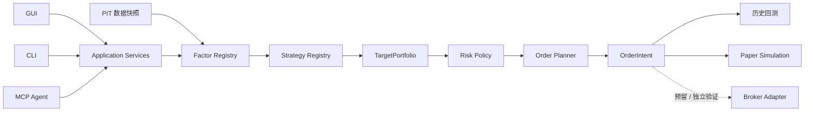

# KabuForge

[English](README.md) · [简体中文](README.zh_CN.md) · [日本語](README.ja_JP.md)

<picture>
  <source media="(prefers-color-scheme: dark)" srcset="brand/kabuforge/v1/logo-horizontal-dark.svg">
  <source media="(prefers-color-scheme: light)" srcset="brand/kabuforge/v1/logo-horizontal-light.svg">
  
</picture>

<p align="center">
  <strong>面向日本股票的 Contract-driven、Local-first 系统化研究与执行框架。</strong><br>
  自定义 Factor 与 Strategy，进行可复现回测和 Paper Simulation，<br>
  并通过 Python、CLI、GUI 或 MCP Agent 操作同一套研究核心。
</p>

<p align="center">
  <a href="https://github.com/Siyuan-chat/KabuForge/releases/tag/v0.1.0-rc.1"></a>
  <a href="https://github.com/Siyuan-chat/KabuForge/actions/workflows/kabuforge.yml"></a>
  
  
  
</p>

<p align="center">
  
</p>

## 为什么是 KabuForge？

很多个人量化项目止步于“信号”或“回测”。KabuForge 的目标是成为一套**研究系统**：研究想法通过明确的 Factor / Strategy contract 进入框架，再经过 Portfolio/Risk、券商中立的订单规划，并由人与 Agent 共享同一套应用服务。

| | 不同之处 |
| --- | --- |
| **可扩展研究** | Factor 与 Strategy 采用注册、版本化的统一规范，而不是写死在回测引擎里。用户可以加入自己的研究逻辑，而不必重写框架。 |
| **统一决策链** | Factor → Strategy → TargetPortfolio → Risk → Planner → OrderIntent，研究逻辑与成交机制明确分层。 |
| **Agent 可操作** | GUI、CLI、MCP Agent 共用 Application Services。Agent 可以检查、验证、回测和比较研究，而不能绕过领域边界。 |
| **可审计设计** | PIT 可见性、内容身份、持久调用记录、幂等以及明确的 `UNKNOWN` 状态，让研究与执行过程可追溯、可复现。 |

## 系统架构



目标不是让所有模式得到“完全相同的成交”，而是保持**相同的研究和决策语义**，把执行差异显式留在执行层。

## 写自己的 Factor 与 Strategy

KabuForge 把 Factor 当作可复现的研究单元，而不是一个临时计算函数：

```text
FactorSpec + FactorContext
        ↓
     FactorResult
```

Strategy 消费已注册的因子结果，并输出券商中立的目标组合：

```text
FactorResult(s)
      ↓
   Strategy
      ↓
StrategyDecision
      ↓
TargetPortfolio
```

自定义实现通过受控 Registry 注册；配置文件不能请求任意 Python import 或 eval。这样可以自由尝试新因子、替换策略逻辑、比较研究设计，而不需要修改执行引擎。

## 快速开始

KabuForge 需要 Python 3.12+。

```shell
git clone https://github.com/Siyuan-chat/KabuForge.git
cd KabuForge
python -m pip install .[gui]

kabuforge doctor
kabuforge demo --out output/demo
kabuforge factors
kabuforge strategies
```

演示完全使用离线合成数据：**不需要 J-Quants key、券商账户、私有因子或行情缓存。**

### 桌面工作台

Windows：

```shell
Launch_KabuForge.bat
```

### Agent / MCP

启动本地 stdio MCP：

```shell
kabuforge mcp --workspace output/agent_workspace
```

R0/R1 默认开放给检查与本地研究；Paper 修改需要显式开启：

```shell
kabuforge mcp --workspace output/agent_workspace --enable-paper
```

接入支持 MCP 的 Agent 后，用户可以让 Agent 在同一研究平台上完成诸如：验证策略、运行多个参数案例、比较回测、检查运行证据并总结差异，而不必自己编写每一步操作代码。

Agent 权限边界：

```text
R0  读取             默认启用
R1  本地计算         默认启用
R2  本地状态修改     显式 opt-in
R3  外部副作用       本 RC 禁用
```

## 从研究走向执行

| 层级 | RC 状态 |
| --- | --- |
| Point-in-time 因子研究 | ✅ 可用 |
| 自定义 Factor / Strategy contract | ✅ 可用 |
| 历史回测 | ✅ 可用 |
| 本地 Paper Simulation | ✅ 可用 |
| 券商中立订单规划 | ✅ 可用 |
| 券商协议映射 / mock | 🧪 验证层 |
| 真实券商下单 | ⛔ 本 RC 未启用 |

Paper Simulation 是历史研究与真实时间运行之间的桥：在未来信任真实券商连接之前，同一套 Strategy 可以先面对真实时间轴、账户状态、整手约束、现金限制和订单规划。

## Research correctness first

KabuForge 明确区分“数据存在”和“决策时刻已经知道这些数据”。

- 严格输入使用带时区的 `available_at`；
- 决策时刻之后的数据不会进入更早的决策；
- Factor / Data / Config 身份参与可复现性；
- 后来的执行价格不能反向改变已经形成的 Strategy target；
- 不确定的提交状态是 `UNKNOWN`，而不是盲目 retry；
- 合成演示不宣称投资收益。

`check_point_in_time` 和 `check_lookahead` 是可见性检查，不代表所有外部数据都已获得完整历史 PIT 认证。

## 三种入口，一套核心

```text
Human ── GUI ─┐
Developer ─ CLI ─┼── Application Services ── Research / Risk / Planning
Agent ── MCP ───┘
```

入口可以变化，领域 contract 不变。

## 文档

| 主题 | English | 日本語 | 简体中文 |
| --- | --- | --- | --- |
| 架构 | [EN](docs/en_US/ARCHITECTURE.md) | [JA](docs/ja_JP/ARCHITECTURE.md) | [ZH](docs/zh_CN/ARCHITECTURE.md) |
| Factor API | [EN](docs/en_US/FACTOR_API.md) | [JA](docs/ja_JP/FACTOR_API.md) | [ZH](docs/zh_CN/FACTOR_API.md) |
| Strategy API | [EN](docs/en_US/STRATEGY_API.md) | [JA](docs/ja_JP/STRATEGY_API.md) | [ZH](docs/zh_CN/STRATEGY_API.md) |
| Agent / MCP | [EN](docs/en_US/AGENT_API.md) | [JA](docs/ja_JP/AGENT_API.md) | [ZH](docs/zh_CN/AGENT_API.md) |
| 执行 | [EN](docs/en_US/EXECUTION.md) | [JA](docs/ja_JP/EXECUTION.md) | [ZH](docs/zh_CN/EXECUTION.md) |
| 研究方法 | [EN](docs/en_US/RESEARCH_METHODOLOGY.md) | [JA](docs/ja_JP/RESEARCH_METHODOLOGY.md) | [ZH](docs/zh_CN/RESEARCH_METHODOLOGY.md) |
| 安全 | [EN](docs/en_US/SECURITY.md) | [JA](docs/ja_JP/SECURITY.md) | [ZH](docs/zh_CN/SECURITY.md) |

所有正式项目文档都通过 manifest 与 CI 按 English / 日本語 / 简体中文三种语言维护。

## Release Candidate

当前公共候选版本为 **v0.1.0-rc.1**，包含 wheel / sdist、校验和以及公开验证证据。

[Release](https://github.com/Siyuan-chat/KabuForge/releases/tag/v0.1.0-rc.1) · [验证记录](docs/RELEASE_VALIDATION.md) · [Roadmap](ROADMAP.md) · [Contributing](CONTRIBUTING.md)

本 RC **不宣称**真实券商已可用、策略具有盈利能力，也不宣称所有历史数据已完成 PIT 认证。

---

KabuForge 是研究与模拟软件，不构成投资建议。详见 [DISCLAIMER.md](DISCLAIMER.md) 与 [SECURITY.md](SECURITY.md)。
