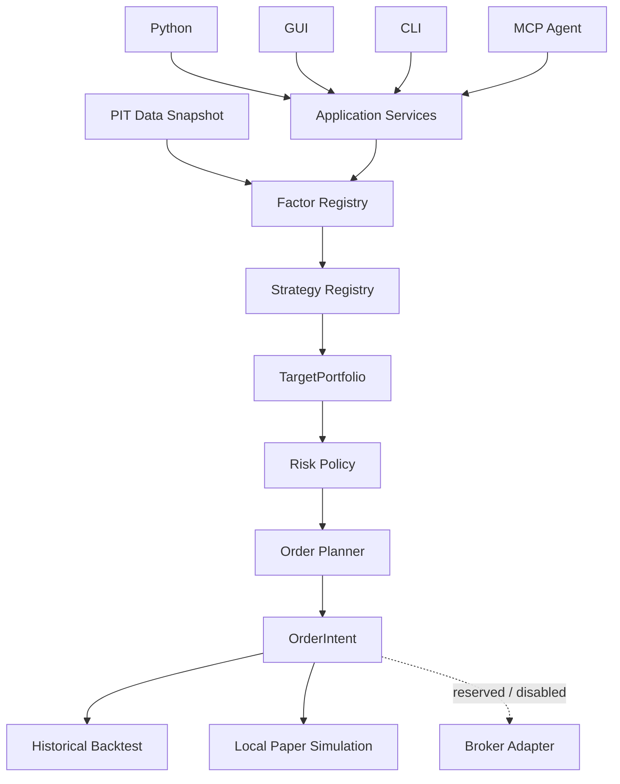

Python や J-Quants で日本株を調べていて、新しいアイデアを試すたびに、データの読み込み、設定、実行、結果の整理を作り直していないでしょうか。

[以前公開した日本株バックテストツール](https://zenn.dev/dudumimi/articles/4d7fd08e242eb6)を、**自分の Factor / Strategy を接続し、同じルールで実行・比較・追跡するための研究基盤「KabuForge」**として開発しています。

今回のテーマは、Factor / Strategy の拡張、MCP 経由の Agent 操作、そして Backtest とローカル Paper で共有する意思決定の仕組みです。

プロジェクトの概要と導入ガイドをまとめた[公式サイト（日本語）](https://kabuforge.com/ja/)も公開しました。[英語版](https://kabuforge.com/)も用意しています。

ソースコードと実装の詳細はこちらです。

https://github.com/Siyuan-chat/KabuForge

以下は、リポジトリにある日本語 GUI の操作例です。


*既存のローカル研究環境を記録した操作デモです。画面内の過去曲線は、現在の公開 Factor や合成 Demo の成績を示しません。今回の A/B/C 比較や MCP 操作の録画ではありません。*

## 1. 前回：バックテストツールを作った

前回は「JP Equity Backtest Console」という名前で、J-Quants を利用したファクター分析・バックテストツールを紹介しました。

https://zenn.dev/dudumimi/articles/4d7fd08e242eb6

各 Factor が共通形式の結果を返し、ファクターを後から追加できる構造も、この時点で用意していました。

今回進めたかったのは、その先です。

例えば、Value と Momentum の配分を三つの設定で比較したいとします。

| Case | Value | Momentum |
| --- | ---: | ---: |
| A | 70% | 30% |
| B | 50% | 50% |
| C | 30% | 70% |

比較したいのは重みの違いです。それなのに、データ、銘柄集合、前処理、コストまで変わってしまえば、何が結果を変えたのか分からなくなります。

必要なのは、「ファクターを追加できること」だけではなく、**変更した条件と固定した条件を区別し、結果の由来まで確認できること**でした。

以降では、この三つの設定を研究課題の例として使います。A/B/C の実測成績を紹介するものではありません。

## 2. Factor / Strategy を交換可能にする

### 自分の Factor は、どこにつなぐのか

Factor は、ある時点で見えていたデータから、銘柄ごとの値やシグナルを作る研究単位です。注文は作りません。

基本となる境界は次の形です。

```text
FactorSpec + FactorContext → FactorResult
```

`FactorSpec` は実装やパラメーター、`FactorContext` は判断時点のデータ、`FactorResult` は計算結果を表します。

公開リポジトリには、価格変化を計算する小さな拡張例があります。Factor の登録部分を抜き出すと、次のようになります。

```python
from kabuforge.api import ApplicationService
from examples.extension_demo import (
    compute_price_change,
    validate_price_change,
)

app = ApplicationService()
app.register_factor(
    "example.price_change",
    "1",
    compute_price_change,
    validate_price_change,
)
```

新しい Factor では、計算関数と設定を検証する関数を実装し、ID とバージョンを指定して登録します。専用の基底クラスを継承する必要はありません。

上のコードは Factor の登録部分だけです。Strategy の登録、合成入力、設定検証、注文計画まで含めた例は、リポジトリをインストールした環境で実行できます。

```shell
python examples/extension_demo.py --out output/extension_demo
```

出力先には未使用のディレクトリを指定してください。この例は架空銘柄の価格変化を計算し、Strategy、Risk、Planner へ渡します。注文実行や約定は行いません。

[実行可能な拡張例](https://github.com/Siyuan-chat/KabuForge/blob/main/examples/extension_demo.py) ／ [Factor 拡張ガイド](https://github.com/Siyuan-chat/KabuForge/blob/main/docs/ja_JP/FACTOR_API.md)

なお、登録はサービスのインスタンスごとです。別の CLI・GUI・MCP プロセスに自動で反映されるわけではなく、利用する入口にも同じ登録処理を組み込む必要があります。

### 数か月後にも、その結果を説明できるか

設定の版とアルゴリズムの版は別々に扱います。計算の識別には、データ snapshot、universe、判断時刻も含めます。

「Value を計算した」ではなく、「どの実装を、どの設定とデータで、いつの判断として計算したか」を区別するためです。

もう一つの問いが、**当時、その情報を見ることができたか**です。

`FactorContext` は判断時刻を `decision_at`、入力が利用可能になった時刻を `available_at` として扱います。判断より後に利用可能になる行は読み取り対象から外し、可視時刻の欠落やタイムゾーンの不備はエラーにします。

後から取得したデータを、そのまま過去にも見えていたことにしないための境界です。

### Strategy は「何を持ちたいか」を決める

Strategy は Factor の結果から、目標ポートフォリオを決めます。

先ほどの A/B/C なら、例えば設定内の Factor ID を `value` と `momentum` に揃えた上で、合成式の係数を変えます。

```json
{
  "scoring": {
    "formula": "0.7 * value + 0.3 * momentum"
  }
}
```

これは設定の抜粋です。前処理も含め、データ snapshot、期間、銘柄集合、調整タイミング、コストなどは固定します。異なる尺度の値を混ぜるため、係数だけでなく標準化の方法も比較条件に含めます。

Strategy が返すのは「100株買う」という注文ではなく、`TargetPortfolio` です。例えば「SYN_A を50%保有したい」という研究上の判断を表します。

現在の保有や現金からどう移行するかは、後段に任せます。独自 Strategy も登録できますが、現在の設定スキーマが許容する範囲で接続します。

[Strategy 拡張ガイド](https://github.com/Siyuan-chat/KabuForge/blob/main/docs/ja_JP/STRATEGY_API.md)

## 3. Backtest Engine から Research Platform へ

全体の関係は、リポジトリの README にある次の図で表せます。



GUI、CLI、Python、MCP は、共通の Application Service を入口にします。ここは設定検証と意思決定、注文計画の境界であり、それ自体が発注や執行台帳への書き込みを行うわけではありません。

Factor は値を計算し、Strategy は持ちたい組み合わせを決める。Risk は許容できる配分へ制約を適用し、Planner は口座状態、価格、現金、売買単位などを踏まえて `OrderIntent` を作る。その先で Execution が執行を扱います。

拡張例では、Strategy が要求した一銘柄への比率1が、Risk の上限によって0.5へ制限されます。さらに売買単位を適用すれば、計画後の配分がちょうど50%になるとは限りません。

この差を Factor の計算に混ぜないことが、分離の目的です。

> **「同じコード」より重要なのは、「同じ意味論」である。**

Backtest と Paper で約定結果が一致する必要はありません。しかし、目標、判断時刻、制約がそれぞれ何を意味するかは揃えたい。研究価格と後の執行価格も分け、後から得た価格で過去の選定をやり直さないようにしています。

A/B/C の比較でも、曲線だけでなく、設定、snapshot、実装の版、実行記録へ戻れることを重視しています。


*リポジトリにある既存 GUI の履歴表示例です。今回の三条件比較や MCP 呼び出し記録を示す画像ではありません。*

[アーキテクチャ](https://github.com/Siyuan-chat/KabuForge/blob/main/docs/ja_JP/ARCHITECTURE.md)

## 4. Agent から KabuForge を操作する

MCP の追加で試したかったのは、**Agent に研究結果を想像させるのではなく、研究基盤を操作させること**です。

例えば、workspace に A/B/C の設定と必要な入力を準備した上で、次のように依頼します。

> A、B、C の研究条件を確認し、重み以外の差があれば実行前に報告してください。設定とデータ可視性を検証し、各 Backtest を実行してください。完了後、結果、変更条件、各 Run の識別情報をまとめてください。

この操作を支えるのは、自由な Python shell ではなく、公開された構造化ツールです。既存設定を使う場合の流れは、例えば次のようになります。

```text
get_capabilities / list_factors / list_strategies
    ↓ 利用できる実装と権限を確認
validate_config / check_point_in_time
    ↓ 設定と宣言された可視時刻を検査
run_backtest
    ↓ job_id を使って進行・結果を確認
get_job_status / get_job_result
    ↓ 完了した Run を調べる
inspect_run / get_run_report / compare_runs
```

これは操作手順の例であり、収録済みの MCP 実行ログではありません。三つの Run は必要な組み合わせで二つずつ比較し、設定の違いも併せて読み取ります。

チャットに「完了しました」と出るだけではなく、実際の呼び出しと Run を確認できることが重要です。呼び出しには JSON Schema による検証、workspace 内のパス制限、永続的な呼び出し記録を適用します。

### 設定の保存と実行を、同じ権限にしない

MCP サーバーは次のコマンドで起動します。利用する Agent 側では、この起動コマンドを stdio MCP 接続として設定します。

```shell
kabuforge mcp --workspace output/agent_workspace
```

既定では、R0 の読み取りと、R1 の検証・分析・計画・ローカル Backtest などを利用できます。

Strategy draft の保存や Paper の状態変更は R2 です。これらを使う場合には、明示的に有効化します。

```shell
kabuforge mcp --workspace output/agent_workspace --enable-paper
```

R2 では `agent_call_id` と `idempotency_key` も要求します。応答が不明だからといって、新しい識別子で同じ変更をやり直さないためです。

つまり、準備済みの A/B/C を検証・実行することと、Agent が設定を保存することは別の権限です。独自 Factor のコードを開発・検証する作業も、この MCP 接続だけで自動的に済むわけではありません。

[Agent API・権限の説明](https://github.com/Siyuan-chat/KabuForge/blob/main/docs/ja_JP/AGENT_API.md) ／ [公開ツールの実装](https://github.com/Siyuan-chat/KabuForge/blob/main/framework_v2/agent/core.py)

## 5. Backtest の外へ：Paper と Broker

Backtest で候補を選んだ後には、「現在の現金と保有から、この目標へ移行できるか」という別の問いがあります。

現在のローカル Paper は、口座状態、journal、模擬約定を使って、その状態変化を確かめるためのものです。Factor から目標、Risk、注文計画までの意味を共有し、その先の実行環境を分けています。

将来の Broker 接続に向けては、証券会社に依存しない `OrderIntent` と Adapter の境界を用意しています。ただし、実際の外部接続は別途検証する対象です。

:::message
現在のパッケージ版は `0.1.0rc1` です。Backtest / Paper はローカルシミュレーションで、実ブローカー発注と R3 の外部アクションは無効です。指定 timeline に沿う Paper と、実時間で常駐する運用は区別しています。

PIT 検査は宣言された `available_at` を検査するもので、過去データの改訂、銘柄集合、企業行動などの品質を全面的に証明するものではありません。合成 Demo や既存の画面録画も、投資成績の証明には使いません。
:::

[Execution の境界](https://github.com/Siyuan-chat/KabuForge/blob/main/docs/ja_JP/EXECUTION.md) ／ [研究方法と制限](https://github.com/Siyuan-chat/KabuForge/blob/main/docs/ja_JP/RESEARCH_METHODOLOGY.md)

## 6. 公式サイト：概要から最初の実行まで

研究基盤としての機能が増えるにつれて、初めて使う方が「どこから始めればよいか」を見つけやすくしたいと考え、公式サイトを用意しました。

https://kabuforge.com/ja/

サイトでは、Factor → Strategy → Risk & Planner → OrderIntent の流れと、Python・CLI・デスクトップ GUI・MCP の入口を紹介しています。英語版と日本語版があり、概要を読んでから、目的に合ったガイドへ進めます。

| 知りたいこと | サイトの入口 |
| --- | --- |
| インストールして、最初の実行を確かめたい | [クイックスタート](https://kabuforge.com/ja/docs/quickstart/) |
| API キーなしで、入力から結果保存まで試したい | [オフラインの合成デモ](https://kabuforge.com/ja/examples/offline-demo/) |
| Factor・Strategy と注文計画の関係を理解したい | [アーキテクチャ](https://kabuforge.com/ja/docs/architecture/) |
| Agent から接続し、操作範囲を確認したい | [MCP ガイド](https://kabuforge.com/ja/docs/mcp/) |
| PIT 検査や模擬約定の限界を確認したい | [研究方法と制約](https://kabuforge.com/ja/docs/methodology/) |

公式サイトは、ローカルで動かす KabuForge の紹介とドキュメントの入口です。インストール後の研究・バックテスト・Paper シミュレーションは、自分の環境で実行します。

最初はクイックスタートから合成 Demo を試し、その後にアーキテクチャや拡張ガイドを読むと、各機能の役割をつかみやすくなります。実装を詳しく確認したい場合は、記事中の GitHub リンクからコードや API 契約へ進めます。

## 7. KabuForge で何を研究できるか

入口として考えているのは、三つの使い方です。

一つは、Value / Momentum の配分や前処理を、一つずつ条件を変えて比較すること。もう一つは、自分の Factor / Strategy を接続すること。そして、設定検証、実行、結果確認を Agent から操作することです。

まずは Python 3.12 以上の環境で、公開 Demo を試せます。

```shell
git clone https://github.com/Siyuan-chat/KabuForge.git
cd KabuForge
python -m pip install .
kabuforge doctor
kabuforge demo --out output/demo
kabuforge factors
kabuforge strategies
```

この Demo はオフラインの合成データで動くため、J-Quants キーや証券口座は不要です。出力先には新しいディレクトリを使ってください。実データを使う研究では、別途データの準備と利用条件の確認が必要です。

**まず Demo を動かす：** [公式サイトのクイックスタート](https://kabuforge.com/ja/docs/quickstart/) ／ [オフライン Demo ガイド](https://kabuforge.com/ja/examples/offline-demo/)

**自分の研究を接続する：** [Factor ガイド](https://github.com/Siyuan-chat/KabuForge/blob/main/docs/ja_JP/FACTOR_API.md) ／ [Strategy ガイド](https://github.com/Siyuan-chat/KabuForge/blob/main/docs/ja_JP/STRATEGY_API.md) ／ [拡張例](https://github.com/Siyuan-chat/KabuForge/blob/main/examples/extension_demo.py)

**Agent から操作する：** [公式サイトの MCP ガイド](https://kabuforge.com/ja/docs/mcp/) ／ [Agent API の詳細](https://github.com/Siyuan-chat/KabuForge/blob/main/docs/ja_JP/AGENT_API.md)

KabuForge は、完成済みの売買戦略を配ることよりも、自分の研究を持ち込み、検証を積み重ねるための基盤を目指しています。

日本株を Python で研究している方にも、状態と権限を持つ MCP アプリケーションを作っている方にも、試してもらえると嬉しいです。使いにくかった点や接続したい研究アイデアは、[Issue](https://github.com/Siyuan-chat/KabuForge/issues) で教えてください。

プロジェクトの概要と導入ガイドは、[公式サイト](https://kabuforge.com/ja/)にまとめています。GitHub で気に入ってもらえたら、Star も励みになります。

https://github.com/Siyuan-chat/KabuForge

---

KabuForge — Reproducible quantitative research for Japanese equities.

研究・シミュレーション用ソフトウェアです。投資助言や銘柄推奨を目的としたものではありません。
