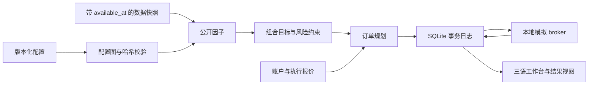

# KabuForge 公开引擎 v2

此目录是 JP Equity Backtest Console 的新一代研究引擎与 PySide6 工作台。使用仓库已有 `factors/` 公开算法；不依赖本机私有项目。安装和演示入口见 [仓库 README](../README.md)，完整操作见 [指南](../docs/OPERATIONS.md)。

## 分层架构



| 模块 | 职责 |
| --- | --- |
| `schemas/`, `config.py` | 因子、策略、运行的 JSON Schema；引用图、重复键、秘密字段、内容身份校验 |
| `factors.py`, `legacy_provider.py` | PIT 视图、公开因子注册、参数验证、源代码版本 |
| `strategy.py`, `planner.py` | 因子组合、目标权重、风险约束、交易单位与资金规划 |
| `application.py`, `cli.py` | 统一配置/规划服务与命令行 |
| `store.py`, `execution.py` | 事务账本、幂等键、对账、订单生命周期 |
| `history.py`, `simulation.py` | 显式交易日历与本地撮合 |
| `data_snapshot.py`, `local_io.py` | 输入清单、内容绑定与派生报告 |
| `workbench_service.py`, `workbench_worker.py` | 隔离运行副本、预检、工作进程 |
| `workbench_qt.py`, `product_ui.py` | PySide6 工作台、引导表单与多语言界面 |
| `data_connection.py`, `price_research.py` | 用户授权的 J-Quants 下载与独立简化价格研究 |
| `help_viewer.py`, `manual_content.py` | 离线手册、章节导航及全文搜索 |

## 因子身份

内置实现为 `public.quality`、`public.value`、`public.momentum_12_1`、`public.dual_ma`、`public.reversal`、`public.attention`、`public.behaviour`。动量源文件沿用旧兼容文件名 `residual_momentum_factor_runtime.py`，实际算法是标准 12-1 价格动量，不能称作私有残差动量。

`legacy_factors.py` 保留私有/公开注册协议及身份隔离测试；其中 private 字符串仅是接口约定，不包含私有算法。公开发行的 `BuiltinFactors` 只安装公开实现，拒绝私有 family。外部 JSON 不得指定任意 Python 导入路径。

实现版本绑定因子源码、历史 provider、适配层及 NumPy/Pandas 版本。代码或依赖变化会使旧示例身份失效，应重新生成示例或明确升级配置，不能静默替换。

## 数据契约

每行显式提供带时区的 `available_at`。日期、下载时间、快照创建时间不能自动替代真实历史可见时间。历史股票池同样必须具备可见证据。因子上下文只向旧公开 runner 提供决策时刻可见的行。

`snapshot.inline.v1` 使用内联表；`snapshot.parquet.v1` 将相对路径、SHA256、行数绑定到清单，预检、隔离复制和运行都会验证。任何输入变更均需新身份。

`execution.timeline.v1` 显式给出决策和报价时间；`execution.daily_bars.v2` 分离已知参考价与次日开盘模拟成交价。开盘跳空使资金不足时取消，不能使用事后价格重选目标或改变预先规划的数量。演示交易日历仅用于小型软件演示，不是完整市场日历。

数据中心下载的当前 API 视图没有完整历史修订版本证明。其简化价格研究使用独立模型和连续份额，不能直接成为严格 PIT/Paper 输入；不含完整整手、滑点、股息和容量认证。

## 命令与输出

```powershell
python -B -m framework_v2.cli --help
python -B -m framework_v2.cli factors
python -B -m framework_v2.cli doctor
python -B -m framework_v2.cli demo --out output/demo
python -B -m framework_v2.cli validate output/demo/backtest.json
python -B -m framework_v2.cli history output/demo/backtest.json --timeline output/demo/timeline.json --out output/history
```

`plan` 只生成可审阅意图。`simulate` 在本地 FakeBroker 执行单次模拟。`history` 使用显式时间线，要求新输出目录，不提供 CLI 中断任务自动续跑。`convert-factor` 仅转换旧公开因子参数，保留原始字节，拒绝未知参数；不能代替完整策略转换。

历史输出包括配置身份、因子、订单、成交、现金、净值及 SQLite 日志。SQLite 为事务记录，CSV/JSON 为派生视图。缓存路径须调用者显式给出；缓存键绑定配置、实现、快照、股票池和决策时间，不使用 pickle。

## 订单与账本

注册意图时保留原始/允许目标、证据和预留资金/股数。提交前持久化 `SUBMITTING`，丢失响应进入 `UNKNOWN`。同幂等键但不同 payload、同事件 ID 但不同内容均拒绝。对账先查询并持久化证据，不得盲目重发。

成交、现金、仓位与账户 revision 在同一事务更新。迟到的真实回执在协议测试中仍会入账；异常负现金保留为事实并阻止新单。估值不会修改持仓或解除未知订单门禁。这些协议测试不证明真实券商接口已经交付。

## 桌面、手册与验证

安装 `requirements-gui.txt` 后，从仓库根目录启动 `Launch_KabuForge.bat` 或 `python -B -m framework_v2.workbench_qt`。品牌素材必须保留 `../brand/kabuforge/v1/`。

F1 打开离线阅读器；HTML 手册：[中文](docs/manual_zh_CN.html)、[日本語](docs/manual_ja_JP.html)、[English](docs/manual_en_US.html)。手册源为 `manual_content.py`，导出使用 `help_viewer.export_manuals()`。

```powershell
python -B -m unittest discover -s framework_v2/tests -q
python -B -m framework_v2.capture_acceptance --output output/gui_acceptance
```

软件验证使用合成数据与 mock API；不读取私有因子、真实行情或账户。Qt 离屏截图不替代原生桌面交互、真实网络套餐权限、Windows 凭据持久化或策略投资有效性验证。

## 尚未交付

完整旧 composite/regime 算法等价迁移、自动 paper 续跑、真实 Excel COM / 券商集成和策略上线认证均未完成。`bridge/` 仅为协议参考与 mock 测试材料；参见 [桥接说明](bridge/README.md)。
