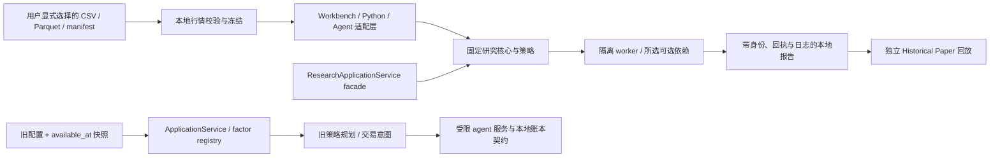

# KabuForge：本地日本股票量化研究引擎

`framework_v2/` 包含 KabuForge 的研究核心、PySide6 工作台与旧版规划/账本服务。它是同一公开项目中的两条兼容路径，不应混淆：旧 `ApplicationService` / agent 规划路径要求显式 `available_at` 与受限执行契约；较新的研究工作流读取用户明确选择的本地行情，并始终标记 RESEARCH-ONLY、`pit_guarantee=false`。公开候选版本为未发布的 `0.2.0rc1`。公开源码 GUI/worker 工作流和 14 条 CLI/MCP 研究路由已完成源码级验证；这些证据不代替干净 wheel 或隔离安装工作流验收。

入口：[仓库 README](../README.md)、[英文集成能力矩阵](../docs/en_US/INTEGRATIONS.md)、[三语 GUI 研究课程](../docs/en_US/GUI_RESEARCH_COURSES.md)。完整旧版操作与 API 契约保留在本目录及 `docs/`。

## 研究工作流



旧规划流与新研究流可以共存，但历史行情研究不会自动变成严格 PIT 输入、前向 Paper 或券商操作。

| 模块 | 责任 |
| --- | --- |
| `research_application.py` | 共享研究 facade；静态操作清单、workspace 边界、固定核心委托、请求/源码哈希、任务回执与失败日志 |
| `local_cache.py`, `data_snapshot.py`, `data_connection.py` | 明确选择的本地行情导入和冻结；旧 snapshot 身份；单独的用户显式连接/下载入口 |
| `price_research.py`, `indicator_research.py` | 默认价格动量/Native MA 研究；TA-Lib 与 `pandas-ta` 指标实现 |
| `factor_research.py`, `factor_strategy_research.py`, `cache.py` | 因子特征与前向评价分离、固定多因子策略、带输入/recipe/实现身份的因子缓存 |
| `model_research.py`, `engine_research.py`, `research_studio_worker.py` | LightGBM/CatBoost 固定时间切分；Native、VectorBT、Backtrader 独立订单回放 |
| `historical_paper_research.py` | 与来源报告绑定的新隔离研究账本、逐步或全量历史回放、只读查询 |
| `broker_research.py`, `broker_readonly.py` | 零网络离线订单映射；显式只读 cash/positions/orders 诊断；无 submit/cancel |
| `price_sensitivity.py`, `report_analysis.py`, `manual_content.py`, `help_viewer.py` | 固定情景诊断、19 图报告与本地 24 章可搜索帮助 |
| `application.py`, `factors.py`, `planner.py`, `store.py`, `execution.py`, `agent/` | 兼容的旧决策、规划、审计与严格外部动作边界；与研究回放契约分开 |

## 数据、因子与身份

旧 `snapshot.inline.v1` 使用内联表；`snapshot.parquet.v1` 把相对路径、SHA256、行数绑定到清单。旧 available-at 检查只验证明示的可见时间，不能替代来源修订、幸存者偏差或经济有效性审查。旧因子 API、注册函数和 schema 仍保留兼容。

旧公开 provider 的因子身份仍是 `public.quality`、`public.value`、`public.momentum_12_1`、`public.dual_ma`、`public.reversal`、`public.attention`、`public.behaviour`。兼容源文件名 `residual_momentum_factor_runtime.py` 实现的是标准 12-1 价格动量，不是私有残差动量。`legacy_factors.py` 保留公开/私有身份协议和隔离测试；公开 `BuiltinFactors` 只安装公开算法。配置拒绝任意 Python import 路径。

研究工作流通过显式选择读取 CSV、Parquet、snapshot 或完成的本地行情 manifest；不扫描目录，不因加载数据而自动请求网络。冻结记录数据来源、选择范围、原始与选中输入身份、价格口径和覆盖诊断。没有可信历史 `available_at` 时不会推断它；研究报告仍为 `pit_guarantee=false`。示例行情由用户提供，原始行情和账户数据不随包分发。

默认策略为价格动量。因子评估将 signal 可用的 feature rows 与 forward-label/evaluation rows 分开，策略只消费 feature-only 输入。因子缓存绑定快照、股票池、决策日、参数、实现和运行时身份，仅用于接入该缓存的因子策略工作流；不代表价格/指标路径或旧数据集全部使用此缓存。TA-Lib 与 native `pandas-ta` 是两个指标 provider；LightGBM 与 CatBoost 使用固定的时间切分；VectorBT 与 Backtrader 是 Native 之外的候选回放引擎。provider、模型或引擎出现在 capability 列表中，不代表当前可选依赖已启动。

旧数据路径使用 `execution.timeline.v1` 的显式决策/报价时间，或 `execution.daily_bars.v2` 的前收参考价和次日开盘模拟成交。开盘跳空导致现金不足时会跳过预先固定数量的订单，不以事后价格改数量或重选目标。小型工程 fixture 使用合成行情和简化日历，不是完整 JPX 交易日历，也不是投资表现数据。

## 旧 API 与 R3 边界

`ApplicationService` 仍是旧配置决策边界，注册可信因子使用 `ApplicationService.register_factor(id, version, function, validator)`，注册可信策略使用 `StrategyRegistry.register(StrategySpec, factory)`。validator 必需；重复身份拒绝；配置不得指定任意 Python import。因子身份与 source/runtime 版本绑定。

旧 agent facade 继续执行 workspace 路径检查、schema 校验、凭证扫描、调用回执和 SQLite 审计。规划只产生可审阅意图，不提交订单。默认 MCP catalog 不提供 R3；即使显式暴露保留 stub，approval、submit、cancel 仍禁用。研究 `Historical Paper` 是新 workspace 内、需要明确 opt-in 的历史教学回放，不是 R3，也不是实时 Paper 或实盘授权。

新研究 facade 只调用静态 allowlist 操作，不接受代码、模块名或解释器路径。paper 变更需服务与单次调用双重 opt-in 和幂等身份；券商只读检查须单独显式触发，并可能向已配置本地端点发 GET。真实终端尚未验证；离线 mapping preview 不读取秘密、不发网络；实盘 submit/cancel 不可用。

## 安装、启动与验证

从源码安装所需 extra，不需要私有运行时路径。主进程不应为了探测能力而导入重型可选库；worker/runtime 的实际可用性以所选操作的回执为准。

```powershell
python -m pip install -e ".[gui]"
python -m pip install -e ".[analytics]"
python -m pip install -e ".[indicators]"
python -m pip install -e ".[models]"
python -m pip install -e ".[backends]"
```

这些是按需选择的标准 extras，不建议不加区分地全部装进 GUI 环境。CLI 的 `demo` 使用虚构离线数据。要从源码启动桌面工作台，可使用仓库根目录的 `Launch_KabuForge.bat`，或：

```powershell
python -B -m framework_v2.workbench_qt
```

开发检查：

```powershell
python -B -m framework_v2.cli --help
python -B -m unittest discover -s framework_v2/tests -q
python -B -m unittest discover -s tools/tests -p "test_sync_version.py" -q
```

本地示例可用 `kabuforge demo --out output/demo`；该命令不会产生真实市场表现证据。离屏 Qt 截图不等于人工桌面验收。当前候选的干净 wheel 与隔离安装工作流验收由独立凭证跟踪；源码 GUI/worker 验收不能替代这些发行验收。版本尚未发布。

旧 CLI 的验证、规划、模拟和显式历史时间线入口仍保留：

```powershell
python -B -m framework_v2.cli factors
python -B -m framework_v2.cli doctor
python -B -m framework_v2.cli demo --out output/demo
python -B -m framework_v2.cli validate output/demo/backtest.json
python -B -m framework_v2.cli history output/demo/backtest.json --timeline output/demo/timeline.json --out output/history
```

`plan` 只生成可审阅意图；`simulate` 使用本地虚构 broker。`history` 要求明确时间线与新输出目录。CLI 示例使用虚构离线数据，不读取 J-Quants 凭证或生成真实行情结论。

## 报告、手册与限制

报告使用暗色仪表盘：15 张总体图、3 张证券价格/执行图和 1 张 Regime 图。参考报告使用实际 TOPIX 收盘价格指数，排除股息并按 NAV 日期精确匹配；缺值不填补。当前归档报告中的 Regime 为 Off/unavailable、0 traces；公开构建默认 Off，私有状态机桥接不包含在内。费用与 +1 观测日延迟诊断由独立固定情景面板运行，不是新的择优策略。

F1 打开离线帮助，包含既有章节和五课程；全文搜索与图片来自包内资源。三语 GUI 课程说明输入身份、指标、因子/模型/引擎、Historical Paper、broker 边界和日志回执；详见上方课程链接。

发布构建必须保留 `brand/kabuforge/v1/` 品牌资源目录；`framework_v2/docs/manual_zh_CN.html`、`manual_ja_JP.html` 和 `manual_en_US.html` 是包内离线手册。报告及缓存路径由调用者显式指定；因子缓存键绑定配置、实现、快照、股票池和决策时钟，不用 pickle。

日历、修订、历史可得时间、公司行动/分红、容量、真实滑点与新鲜 forward-Paper 仍有限。全部展示结果为 RESEARCH-ONLY、`pit_guarantee=false`，不能据此称严格 PIT、fresh OOS、PAPER-READY 或实盘就绪。旧复合因子/Regime 完整算法等价迁移、自动 Paper 续跑、真实 Excel COM 与券商执行认证不是当前公开能力。
